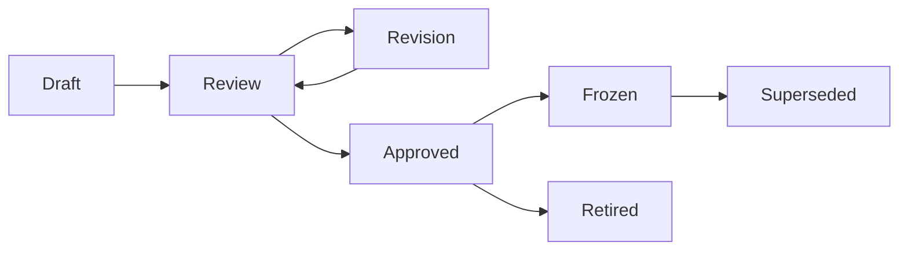
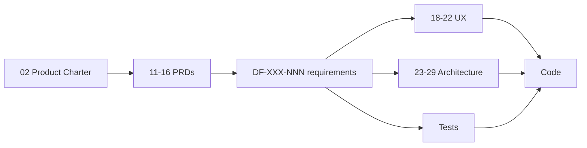

# 01 - Documentation Index and Standards

| Field        | Value      |
| ------------ | ---------- |
| Document ID  | DF-DOC-001 |
| Version      | 0.1.0      |
| Status       | Draft      |
| Owner        | Founder    |
| Last updated | 2026-08-04 |
| Supersedes   | -          |

---

## 1. Purpose

This document defines how the DayFlow AI specification suite is written, numbered,
reviewed, versioned and retired. It is the only document that describes the documents.

## 2. The governing principle

**Documentation is the single source of truth.**

When the code and a document disagree, that is a defect. The document is corrected
first, deliberately, and only then does the code follow. This ordering exists because
DayFlow AI is intended to survive contributors, long gaps between working sessions,
and the founder's own memory. Code explains what the system does; these documents
explain what it is supposed to do and why.

The rule has one pragmatic exception, recorded in section 8: emergency production
fixes ship first and are documented within 48 hours.

## 3. Numbering and location

Documents are numbered 01 to 37 in a single flat sequence, grouped into folders by
concern. The number never changes once assigned, even if a document is retired, so
that external references never rot.

```
docs/
├── 00-governance/     01-05
├── 01-business/       06-10
├── 02-product/        11-17
├── 03-ux/             18-22
├── 04-architecture/   23-29
├── 05-engineering/    30-33
└── 06-operations/     34-37
```

New documents are appended from 38 onward. A retired document keeps its file, gains
`Status: Retired`, and states what replaced it.

## 4. Required structure

Every document opens with the metadata table shown at the top of this file, followed
by a **Purpose** section stating in two or three sentences what question the document
answers. Content sections follow, numbered for citation.

Every document closes with a **Change History** table.

## 5. Writing standards

- **Write for a stranger.** Assume the reader is a competent engineer with no prior
  exposure to DayFlow AI and no access to the conversations that produced it.
- **State the reasoning, not just the conclusion.** A decision without its rationale
  cannot be revisited safely, because nobody can tell whether the circumstances that
  justified it still hold.
- **Record what was rejected.** The options not taken are frequently more useful than
  the one taken.
- **Prefer specifics.** "Reminders repeat at the configured interval, minimum ten
  minutes" rather than "reminders are configurable".
- **One concept, one name.** Terms are defined in [03 - Glossary](03-glossary.md) and
  used identically everywhere. A Moment is never called an entry, a log or a task.
- **Requirement keywords** follow RFC 2119: MUST, MUST NOT, SHOULD, SHOULD NOT, MAY.
  They are written in capitals when used with that force.
- **No emoji, no decorative formatting.** Tables and diagrams where they clarify,
  prose everywhere else.
- **Diagrams are Mermaid**, embedded in the markdown, never binary images, so that
  they diff and merge like text.

## 6. Requirement identifiers

Testable requirements carry a stable identifier so that code, tests and documents can
reference each other:

```
DF-<AREA>-<NUMBER>
```

Areas are `MOM` (moments), `CAT` (categories), `QUE` (queue), `REM` (reminders),
`ANA` (analytics), `GOA` (goals), `AI`, `SET` (settings), `SEC` (security),
`SYN` (sync), `UX`.

For example, `DF-QUE-003` is "a third pending Moment MUST be refused". A test that
verifies it names it, and the code that implements it cites it in a comment. This is
the one category of comment that is always worth writing, because it links an
otherwise arbitrary-looking constant to the decision that produced it.

## 7. Lifecycle



| Status     | Meaning                                                              |
| ---------- | -------------------------------------------------------------------- |
| Draft      | Being written. May be internally inconsistent. Do not build from it. |
| Review     | Complete and awaiting founder review.                                |
| Revision   | Review comments are being addressed.                                 |
| Approved   | Agreed. Implementation may proceed. Changes need a version bump.     |
| Frozen     | Approved and tied to a shipped release. Edits create a new version.  |
| Superseded | Replaced. Names its replacement.                                     |
| Retired    | No longer relevant. Kept for history.                                |

Until DayFlow AI has contributors beyond the founder, review is a self-review with a
deliberate gap of at least one day between writing and approving. The gap is the point:
it is what turns writing into reviewing.

## 8. Versioning of documents

Documents use `MAJOR.MINOR.PATCH` independently of the application version.

- **PATCH** - typos, clarifications, formatting. No meaning changes.
- **MINOR** - new content that does not invalidate anything already approved.
- **MAJOR** - a change that contradicts previously approved content. Requires an entry
  in [04 - Decision Log](04-decision-log.md).

**Emergency exception.** A production incident may be fixed before documentation is
updated. The corresponding documents MUST be updated within 48 hours, and the incident
MUST be recorded in
[36 - Observability and Incident Runbook](../06-operations/36-observability-and-incident-runbook.md).

## 9. Traceability

Every shipped feature traces backwards through the suite:



A feature with no requirement identifier has no business being in the codebase. If it
turns out to be needed, the requirement is written first.

## 10. Maintenance triggers

The suite is reviewed when any of the following happens, not on a calendar:

- A release ships.
- A decision in [04 - Decision Log](04-decision-log.md) is reversed.
- An incident reveals a documented behaviour that was never true.
- A dependency major version is adopted.
- A new contributor joins and asks a question the documents fail to answer. That
  question is itself the defect report.

---

## Change History

| Version | Date       | Author  | Change         |
| ------- | ---------- | ------- | -------------- |
| 0.1.0   | 2026-08-04 | Founder | Initial draft. |
