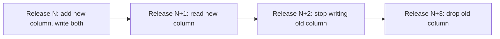

# 05 - Versioning and Release Policy

| Field        | Value      |
| ------------ | ---------- |
| Document ID  | DF-DOC-005 |
| Version      | 0.1.0      |
| Status       | Draft      |
| Owner        | Founder    |
| Last updated | 2026-08-04 |

---

## 1. Purpose

How DayFlow AI is versioned, released, migrated and rolled back, and what counts as a
breaking change. The policy exists so that the product can evolve for years without
stranding a user's history - which, for a tool whose value grows with the length of that
history, is the single most important compatibility guarantee it makes.

## 2. Version scheme

The application follows Semantic Versioning: `MAJOR.MINOR.PATCH`.

| Component | Incremented when                                                                    |
| --------- | ----------------------------------------------------------------------------------- |
| MAJOR     | A user-visible behaviour changes incompatibly, or stored data changes meaning.      |
| MINOR     | A feature is added and everything existing continues to behave as before.           |
| PATCH     | A defect is fixed, performance improves, or copy changes, with no behaviour change. |

Pre-1.0 releases use `0.x.y`, where `x` behaves as MAJOR.

Documents version independently of the application. See
[01 - Documentation Index and Standards](01-documentation-index-and-standards.md) section 8.

## 3. What counts as a breaking change

Breaking, requiring a MAJOR bump:

- A `moments`, `categories` or `parent_categories` column is removed or repurposed.
- A default changes such that existing users experience different behaviour without
  acting - for example lowering the queue limit for accounts already using the old one.
- An API response field is removed or its type changes.
- The Productivity Score formula changes so that historical scores would be recomputed
  to different values.
- Data attribution changes - for example abandoning the midnight split of ADR-010, which
  would silently rewrite every historical daily total.

Not breaking:

- Adding a nullable column.
- Adding an endpoint or a response field.
- Adding an Insight Provider.
- Changing a default for **new** accounts only.

## 4. Database migrations

Migrations live in [`supabase/migrations/`](../../supabase/migrations/), named
`NNNN_description.sql`, applied strictly in order, and never edited once applied to
production. A mistake is corrected by a new migration, because editing an applied
migration means two environments silently diverge with no record of it.

Rules:

- **Forward-only.** No down migrations. Reversal is a new forward migration.
- **Expand then contract.** Adding a column and removing an old one are separate
  releases, so that a rollback of the application code never meets a schema that has
  already dropped what it needs.
- Every migration must be idempotent where practical: `create table if not exists`,
  `create or replace function`, guarded `alter table`.
- Destructive statements require a comment stating what is lost and why it is safe.

The expand-and-contract sequence for renaming a column:

## 5. Release process

1. Merge to `main` after review, with CI green: typecheck, lint, unit tests, build.
2. Apply migrations to staging; run end-to-end tests against it.
3. Tag `vMAJOR.MINOR.PATCH`.
4. Apply migrations to production **before** the code that requires them.
5. Deploy. Vercel builds and promotes.
6. Verify against the smoke checklist in
   [33 - CI/CD and Deployment Runbook](../05-engineering/33-cicd-and-deployment-runbook.md).
7. Publish release notes.

## 6. Rollback

Application code rolls back by promoting the previous Vercel deployment, which is
immediate.

The database does not roll back. This asymmetry is why expand-and-contract is mandatory:
the previous application version must always be able to run against the current schema.
If a migration itself is faulty, the fix is a new migration, and the incident is recorded
per [36 - Observability and Incident Runbook](../06-operations/36-observability-and-incident-runbook.md).

## 7. Feature flags

Incomplete work merges behind a flag rather than living on a long-lived branch. Flags
are rows in `feature_flags`, evaluated per user, defaulting to off.

A flag is temporary infrastructure. Once a feature is fully rolled out, the flag and
both code paths are removed within two releases - otherwise the codebase accumulates
permanent conditional branches that nobody dares delete.

## 8. Data compatibility guarantee

**A user's Moment history MUST remain readable and correctly interpreted across every
future version.**

This is the strongest guarantee the product makes. Concretely:

- Historical Moments are never deleted or rewritten by a migration.
- If aggregation semantics must change, historical values are preserved and the change
  is dated, so that old periods keep their original interpretation.
- Export format changes are additive; the importer accepts every version it has ever
  produced.

## 9. Deprecation

A deprecated capability is announced in release notes, marked in the interface, kept
working for at least two MINOR releases, and only then removed in a MAJOR release.

---

## Change History

| Version | Date       | Author  | Change         |
| ------- | ---------- | ------- | -------------- |
| 0.1.0   | 2026-08-04 | Founder | Initial draft. |
