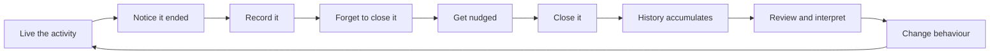

# 07 - Personas and Jobs to be Done

| Field        | Value      |
| ------------ | ---------- |
| Document ID  | DF-DOC-007 |
| Version      | 0.1.0      |
| Status       | Draft      |
| Owner        | Founder    |
| Last updated | 2026-08-04 |

---

## 1. Purpose

Who DayFlow AI is for, what they are actually trying to accomplish, and who it is not
for. Every feature proposal is tested against this document: if it does not serve a job
listed here, it needs a stronger argument than "it would be useful".

## 2. Primary persona - the Deliberate Professional

**Representative:** Prashanth, 27, an IT consultant who is also studying outside work
hours.

**Situation.** Office work consumes most of his day. He is teaching himself Python and
system design in the remaining hours, and trying to keep gym attendance steady. He owns
an Android phone and a work laptop, and moves between them constantly.

**Frustration.** He ends most weeks with the sense that he learned less than he intended,
but cannot say where the hours went. He suspects that short bursts of phone use add up to
something substantial, and he has no evidence either way. He has tried a spreadsheet
twice and abandoned it both times within three weeks.

**Behaviour that matters for design.** He will not remember to start a timer. He will
remember, roughly, what he did when he sits down in the evening - and his recall of the
last two or three hours is good, while his recall of yesterday is poor. This is the single
most important behavioural fact in the product, and it is what the two-slot queue is
designed around.

**What success looks like to him.** Being able to say "I studied nineteen hours this
month, up from eleven" and to see that his study collapses on days when he games after
9pm.

**Jobs:**

| ID      | Job                                                                                          |
| ------- | -------------------------------------------------------------------------------------------- |
| JTBD-P1 | When I finish something, help me record it in seconds so I do not have to interrupt myself.  |
| JTBD-P2 | When I forget to record, chase me before the memory is gone.                                 |
| JTBD-P3 | When I review the week, show me where the time actually went, not where I intended it to go. |
| JTBD-P4 | When I set a learning target, tell me honestly whether I am meeting it.                      |
| JTBD-P5 | When I waste time, quantify it in my own terms rather than a vendor's.                       |

## 3. Secondary persona - the Focused Student

**Representative:** Ananya, 21, in her final undergraduate year, preparing for a
competitive exam alongside coursework.

**Situation.** Long unstructured days that she must organise herself. She studies in
multi-hour blocks and needs to know the true ratio between subjects, because it is easy
to spend all her time on the subject she already enjoys.

**Frustration.** Study apps assume the Pomodoro technique and interrupt her flow.
Retroactive entry is what she needs, and most tools treat it as an afterthought.

**Behaviour that matters.** She studies in blocks long enough that the three-hour warning
will fire during legitimate sessions. Her configuration will differ from the defaults,
which is precisely why the thresholds are configurable rather than fixed.

**Jobs:**

| ID      | Job                                                                                      |
| ------- | ---------------------------------------------------------------------------------------- |
| JTBD-S1 | When I plan revision, show me the real balance between subjects.                         |
| JTBD-S2 | When I study for hours, do not interrupt me, but do notice if I forgot to close a block. |
| JTBD-S3 | When I lose momentum, show me the streak I am about to break.                            |

## 4. Tertiary persona - the Recovering Over-worker

**Representative:** Ravi, 34, a senior engineer who works too much and knows it.

**Situation.** Work bleeds into evenings and weekends. He wants evidence of the pattern,
partly to convince himself and partly to have a conversation with his manager.

**Frustration.** Employer-provided tools measure output and are, structurally, on the
company's side. He wants a record that belongs to him alone.

**Behaviour that matters.** He is the user for whom burnout detection is the headline
feature, and the user most likely to be alarmed by a data-privacy misstep.

**Jobs:**

| ID      | Job                                                                    |
| ------- | ---------------------------------------------------------------------- |
| JTBD-R1 | When work expands, show me the trend with dates I can point to.        |
| JTBD-R2 | When I have not taken a real break in weeks, tell me plainly.          |
| JTBD-R3 | Keep this record mine, on infrastructure my employer does not control. |

## 5. Anti-personas

Recorded so that rejecting their requests is a decision rather than an accident.

**The agency owner** billing clients. Needs projects, rates and invoices. Serving them
would drag the data model toward billing and dilute everything above.

**The employer** monitoring staff. Directly contradicts principle 1 of
[02 - Product Charter](02-product-charter.md). DayFlow AI will not build supervision
features, at any price.

**The passive optimiser** who wants insight with zero effort. Genuinely better served by
RescueTime. Trying to serve them would mean building an OS agent and abandoning
self-declaration.

**The habit tracker user** who wants "did I do it?" rather than "for how long?". Better
served by Daylio or Streaks; duration is the wrong primitive for them.

## 6. Job map for the core loop

Most competitors serve _Capture_ and _Review_ well and ignore _Forget_ and _Nudge_
entirely. Those two stages are where DayFlow AI's distinctive work happens - and they are
where users are lost.

## 7. Design implications

1. **Capture must complete in under ten seconds** from opening the app, on a phone, one
   handed. Every additional required field is a threat to the whole product.
2. **Retroactive entry is the primary path,** not a fallback. Time fields must be as easy
   to set to "an hour ago" as to "now".
3. **Nudges must be genuinely useful,** naming the specific Moment and offering to close
   it directly from the notification.
4. **Defaults must suit the Deliberate Professional,** since he is the primary persona,
   and every one of them must be adjustable for the other two.
5. **The value must be visible before a month passes,** or the Student and the
   Over-worker will leave before the data becomes interesting. Day-one, week-one and
   month-one views each need to be worth opening.

---

## Change History

| Version | Date       | Author  | Change         |
| ------- | ---------- | ------- | -------------- |
| 0.1.0   | 2026-08-04 | Founder | Initial draft. |
