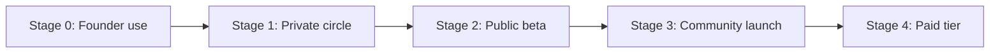

# 09 - Go to Market Plan

| Field        | Value      |
| ------------ | ---------- |
| Document ID  | DF-DOC-009 |
| Version      | 0.1.0      |
| Status       | Draft      |
| Owner        | Founder    |
| Last updated | 2026-08-04 |

---

## 1. Purpose

How DayFlow AI reaches its first users, in what order, and what must be true before each
stage begins. The plan is deliberately slow at the start, because launching a retention
product to strangers before retention is proven wastes the only launch it gets.

## 2. Strategic premise

**The product must be proven on one user before it is shown to a hundred.**

DayFlow AI's core risk is abandonment, not acquisition (see
[06 - Market and Competitive Analysis](06-market-and-competitive-analysis.md) section 7).
Acquiring users before the abandonment problem is solved converts a fixable product
problem into a permanent reputation problem, because the people who churn in week two are
exactly the people who will not return for version 2.

## 3. Stages

### Stage 0 - Founder use, 4 to 8 weeks

The founder is the only user. No marketing, no landing page.

**Exit criteria:** Moments recorded on at least 21 of 30 consecutive days; no data loss;
the reminder cadence feels helpful rather than irritating; at least one behavioural change
the founder can name and attribute to something the product showed them.

If the founder cannot sustain the habit, no stranger will, and the correct response is to
change the product rather than proceed.

### Stage 1 - Private circle, 5 to 15 users

Friends, colleagues and fellow learners, invited personally, onboarded in conversation.

**Purpose:** find out where the product breaks with taxonomies other than the founder's.
The most valuable output is the list of categories other people invent, which will not
resemble the defaults.

**Instrumentation:** direct conversation at day 3, day 14 and day 30. At this size,
talking to people beats analytics.

**Exit criteria:** at least half still recording at day 30; no critical defects
outstanding; onboarding completable without the founder present.

### Stage 2 - Public beta, target 100 to 300 users

A landing page, open signup, and a public changelog.

**Channels, in order of expected value:**

1. **Reddit** - r/productivity, r/getdisciplined, r/selfhosted, r/Indiacoders. Posted as
   a build story, not an advertisement. Communities there punish marketing and reward
   candour, so the post should include what the product does badly.
2. **Hacker News Show HN** - one attempt, timed after the product is genuinely stable.
   The audience is unforgiving of unfinished work and will find the privacy story
   compelling if it is real.
3. **Indie communities** - Indie Hackers, Product Hunt (upcoming page first to gather an
   audience before launching).
4. **Build in public** - a weekly post on X or LinkedIn showing real charts from the
   founder's own data. This is the highest-conviction channel for this specific product,
   because the artefact being shared is inherently interesting and demonstrates the value
   without requiring anyone to sign up first.

**Exit criteria:** day-30 retention above 25%; a stated willingness to pay from at least
10% of active users; infrastructure cost still inside free tiers.

### Stage 3 - Community launch

Longer-form content pointed at the specific problems the product solves: an analysis of
where a month of one's own time actually goes; why timers fail for personal tracking; how
to define distraction for yourself rather than accepting a vendor's definition. Each piece
should be worth reading whether or not the reader ever signs up.

### Stage 4 - Paid tier

Introduced only after the free tier demonstrably retains users. Existing users are
grandfathered onto free forever for everything they already have; the paid tier adds AI
and never removes anything.

## 4. Positioning and messaging

**One line:** Know where your time actually went.

**Three lines:** DayFlow AI records what you really did, not what a monitoring app
guessed. Save an activity with just a start time and it waits for you - and reminds you
until you close it. Then it shows you the patterns you would never have spotted yourself.

**Message by persona:**

| Persona                 | Lead with                                                                   |
| ----------------------- | --------------------------------------------------------------------------- |
| Deliberate Professional | "You planned to study ten hours this week. Here is what actually happened." |
| Focused Student         | "Find out which subject you have been quietly avoiding."                    |
| Recovering Over-worker  | "Evidence, with dates, that work is eating your evenings."                  |

**What not to say:** never "productivity hacks", never "10x your output", never
guilt-based framing. The product's tone is a calm, honest mirror. Guilt drives churn in a
tool that requires daily voluntary effort.

## 5. Onboarding as the primary growth lever

For a retention-limited product, onboarding matters more than any channel.

1. Signup asks for email and password only. No survey, no plan selection.
2. Default categories are seeded immediately, so the first screen is never empty.
3. The first action offered is a single Moment for something already finished today -
   because that teaches retroactive capture, which is the concept everything else rests on.
4. The queue is explained the first time it is used, in one sentence, not in a tour.
5. Notification permission is requested only after the first Moment goes pending, when
   the reason for it is self-evident.
6. Day 1 shows a timeline, day 7 unlocks the first weekly comparison, day 30 the first
   monthly review. Each is a reason to return.

## 6. Referral

No incentivised referral programme. The natural mechanism is that users share their own
charts, so **shareable exports of a weekly or monthly summary** - an image with no
personal identifiers, opt-in per share - are the only referral feature planned.

## 7. Risks

| Risk                                       | Mitigation                                                                    |
| ------------------------------------------ | ----------------------------------------------------------------------------- |
| Launching before retention is proven       | Hard stage gates above; do not skip Stage 0.                                  |
| Reddit and HN rejecting a promotional post | Post as a build story with honest limitations; never lead with a signup link. |
| Signup friction losing visitors            | A public demo with sample data, requiring no account.                         |
| A competitor copying the queue mechanic    | Unavoidable. Compete on depth and on being unencumbered by billing features.  |
| Founder attention lapsing                  | Documentation-first development means work resumes cheaply after a gap.       |

---

## Change History

| Version | Date       | Author  | Change         |
| ------- | ---------- | ------- | -------------- |
| 0.1.0   | 2026-08-04 | Founder | Initial draft. |
