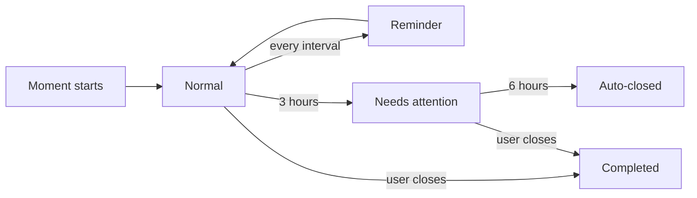

# 12 - PRD: Queue and Reminder Engine

| Field        | Value      |
| ------------ | ---------- |
| Document ID  | DF-DOC-012 |
| Version      | 0.1.0      |
| Status       | Draft      |
| Owner        | Founder    |
| Last updated | 2026-08-04 |

---

## 1. Purpose

The requirements for DayFlow AI's signature mechanic: the bounded queue of Pending
Moments, and the escalating attention system that resolves them. This is the part of the
product that has no direct equivalent elsewhere, and the part most likely to be judged
either brilliant or annoying. The difference between those two outcomes is entirely in
the details specified here.

## 2. Design rationale

Every timer-based tracker eventually produces the same failure: a timer left running
overnight, discovered the next morning as an eleven-hour "Deep Work" block. The user knows
it is wrong, cannot reconstruct the truth, and either fabricates a number or deletes it.
After this happens three or four times, they stop trusting the data and stop using the
tool.

DayFlow AI treats forgetting as the expected behaviour rather than user error, and builds
three mechanisms around it:

1. **A ceiling** on how much can be forgotten at once - the Queue Limit.
2. **Escalating pressure** to resolve what is open - the reminder ladder.
3. **A backstop** that closes what was clearly abandoned, flagged as estimated rather
   than silently trusted - auto-close.

## 3. The Queue

### 3.1 Definition

The Queue is the set of the current user's Moments with `status = 'pending'`. It is a
view over `moments`, not a table, so it can never disagree with the underlying data.

### 3.2 Requirements

| ID         | Requirement                                                                                                                     |
| ---------- | ------------------------------------------------------------------------------------------------------------------------------- |
| DF-QUE-001 | The Queue MUST hold at most `settings.queue_limit` Pending Moments. Default 2.                                                  |
| DF-QUE-002 | `queue_limit` MUST be configurable between 1 and 5 inclusive.                                                                   |
| DF-QUE-003 | Creating a Moment that would exceed the limit MUST be refused, not warned about.                                                |
| DF-QUE-004 | The refusal MUST name the Pending Moments and offer to close one inline, without losing the data already entered.               |
| DF-QUE-005 | The limit MUST be enforced by a database trigger as well as in the client.                                                      |
| DF-QUE-006 | Lowering `queue_limit` below the current pending count MUST be allowed; existing Pending Moments MUST NOT be closed or deleted. |
| DF-QUE-007 | While over the limit after such a change, no new Pending Moment may be created until the count falls below the new limit.       |
| DF-QUE-008 | Remaining capacity MUST be visible at all times, phrased as free slots.                                                         |
| DF-QUE-009 | Queue state MUST be consistent across devices within the sync target of 5 seconds.                                              |

DF-QUE-003 is the decision recorded in ADR-009. A dismissible warning becomes invisible
within a week; the mechanic only works if it genuinely holds.

DF-QUE-004 is what separates a helpful constraint from an obstruction. Refusing without
offering the fix would be hostile.

### 3.3 Queue card

Each Pending Moment is presented as a card showing the Category, its Parent Category
colour, the start time in both absolute and relative form ("14:30, 2h 15m ago"), elapsed
time updating live, urgency state, and two primary actions: **End now** and **Set end
time**.

| ID         | Requirement                                                                                    |
| ---------- | ---------------------------------------------------------------------------------------------- |
| DF-QUE-020 | **End now** MUST close the Moment with the current time in a single tap, with no confirmation. |
| DF-QUE-021 | **Set end time** MUST open a time picker defaulted to the current time.                        |
| DF-QUE-022 | Elapsed time MUST update at least once per minute while the view is open.                      |
| DF-QUE-023 | Cards MUST be ordered oldest first, so the most at-risk memory is addressed first.             |
| DF-QUE-024 | The card MUST reflect its urgency state per section 5.                                         |

DF-QUE-020 having no confirmation is deliberate: closing a Moment must be the easiest
action in the product, because every unit of friction there increases the auto-close rate,
which is the metric that indicates the mechanic is failing.

## 4. Reminder engine

### 4.1 Cadence

| ID         | Requirement                                                                                                    |
| ---------- | -------------------------------------------------------------------------------------------------------------- |
| DF-REM-001 | While a Moment is Pending, a reminder MUST be sent every `settings.reminder_interval_minutes`. Default 60.     |
| DF-REM-002 | The interval MUST be configurable, with a minimum of 10 minutes.                                               |
| DF-REM-003 | The first reminder MUST be sent one interval after `start_at`, not immediately.                                |
| DF-REM-004 | Reminders MUST stop as soon as the Moment leaves `pending`, by any route.                                      |
| DF-REM-005 | Each Pending Moment MUST be reminded about independently.                                                      |
| DF-REM-006 | If more than one reminder is due simultaneously, they MUST be combined into a single notification.             |
| DF-REM-007 | A reminder MUST NOT be sent during Quiet Hours.                                                                |
| DF-REM-008 | Reminders suppressed by Quiet Hours MUST be dropped, never queued for later delivery.                          |
| DF-REM-009 | The engine MUST record `last_reminder_at` per Moment so that cadence survives restarts and duplicate job runs. |
| DF-REM-010 | The engine MUST be idempotent: running the job twice in the same window MUST NOT produce two notifications.    |

DF-REM-002's ten-minute floor exists to stop the user configuring the product into being a
nuisance and then uninstalling it. DF-REM-008 avoids the worse-than-nothing outcome of six
suppressed reminders arriving together at 07:00.

DF-REM-010 matters because the job is triggered externally by `pg_cron` over HTTP, and any
externally triggered job will eventually be delivered twice.

### 4.2 Content

Notifications must be specific enough to act on without opening the app.

| ID         | Requirement                                                                                 |
| ---------- | ------------------------------------------------------------------------------------------- |
| DF-REM-020 | A reminder MUST name the Category and the elapsed time.                                     |
| DF-REM-021 | A reminder MUST carry an **End now** action that closes the Moment without opening the app. |
| DF-REM-022 | Tapping the body MUST deep-link to that Moment's edit form.                                 |
| DF-REM-023 | A combined reminder MUST state the count and deep-link to the queue.                        |

Example single: _"Still on Python? Started 14:30, running 2h 5m."_ with actions **End now**
and **Open**.

Example combined: _"2 activities still open - Python (2h 5m), Gym (1h 10m)."_

### 4.3 Delivery

| ID         | Requirement                                                                                              |
| ---------- | -------------------------------------------------------------------------------------------------------- |
| DF-REM-030 | Reminders MUST be delivered by Web Push to every registered device of the user.                          |
| DF-REM-031 | Permission MUST be requested only after the user's first Pending Moment exists, never at signup.         |
| DF-REM-032 | If permission is denied, in-app reminders MUST still be shown, and the product MUST remain fully usable. |
| DF-REM-033 | Failed subscriptions returning HTTP 404 or 410 MUST be deleted automatically.                            |
| DF-REM-034 | Delivery MUST be attempted within 2 minutes of the scheduled time, at least 95% of the time.             |

DF-REM-031 is an onboarding decision: a permission prompt at signup, before the user knows
what the app does, is the most reliable way to get a permanent denial.

## 5. Escalation ladder

| State           | Elapsed       | Card appearance       | Notification                          |
| --------------- | ------------- | --------------------- | ------------------------------------- |
| Normal          | Under 3 hours | Standard              | Regular reminder each interval        |
| Needs attention | 3 to 6 hours  | Warning colour, badge | Higher-urgency, explicit prompt       |
| Auto-closed     | Over 6 hours  | Removed from queue    | One notification explaining the close |

### 5.1 Long activity warning

| ID         | Requirement                                                                                                |
| ---------- | ---------------------------------------------------------------------------------------------------------- |
| DF-REM-040 | On passing `long_activity_warning_minutes` (default 180), the Moment MUST enter the Needs Attention state. |
| DF-REM-041 | The card MUST show the warning treatment and the message "Immediate action required".                      |
| DF-REM-042 | A single higher-urgency notification MUST be sent at the transition, in addition to the ordinary cadence.  |
| DF-REM-043 | The threshold MUST be configurable between 60 and 720 minutes.                                             |

The wide configurable range exists because the Focused Student persona genuinely studies
in four-hour blocks. A fixed three-hour warning would make the product wrong for her.

### 5.2 Auto-close

| ID         | Requirement                                                                                                          |
| ---------- | -------------------------------------------------------------------------------------------------------------------- |
| DF-REM-050 | On passing `auto_close_minutes` (default 360), the system MUST close the Moment automatically.                       |
| DF-REM-051 | Auto-close MUST set `end_at = start_at + auto_close_minutes`, `status = 'auto_closed'` and `source = 'auto_close'`.  |
| DF-REM-052 | The user MUST be notified, with the reason stated and a direct link to correct the end time.                         |
| DF-REM-053 | The threshold MUST be configurable between 120 and 1440 minutes, and MUST always exceed the long activity threshold. |
| DF-REM-054 | Auto-close MUST be disableable entirely by the user.                                                                 |
| DF-REM-055 | Auto-closed Moments MUST be visually flagged wherever they appear, including the timeline and edit form.             |
| DF-REM-056 | Analytics MUST offer a control to exclude auto-closed Moments.                                                       |
| DF-REM-057 | Auto-close MUST free the Queue Slot immediately.                                                                     |

The rationale for the six-hour default is a belief about human behaviour: a single unbroken
focused activity lasting six hours is far more likely to be a forgotten entry than a real
event. The Moment is kept rather than deleted, because the activity did happen and deleting
it would understate the day - but it is marked as estimated, because presenting a system
guess with the same confidence as a fact is how a product loses trust. This is ADR-013.

## 6. Scheduling

Per ADR-008, `pg_cron` inside Supabase calls the application's cron endpoints over HTTP
with a bearer secret.

| Job          | Cadence      | Work                                                                   |
| ------------ | ------------ | ---------------------------------------------------------------------- |
| `reminders`  | every 10 min | Find Pending Moments due a reminder; respect quiet hours; send; stamp. |
| `auto-close` | every 15 min | Find Pending Moments past the auto-close threshold; close and notify.  |

| ID         | Requirement                                                                                           |
| ---------- | ----------------------------------------------------------------------------------------------------- |
| DF-REM-060 | Cron endpoints MUST reject any request without the correct `CRON_SECRET` bearer token, returning 401. |
| DF-REM-061 | Jobs MUST process users in batches and MUST NOT fail wholesale because one user's send failed.        |
| DF-REM-062 | Every run MUST log counts of evaluated, sent, skipped and failed.                                     |
| DF-REM-063 | Jobs MUST complete within 60 seconds or checkpoint and resume on the next run.                        |

## 7. Quiet Hours

| ID         | Requirement                                                                                 |
| ---------- | ------------------------------------------------------------------------------------------- |
| DF-SET-010 | The user MUST be able to define a daily quiet window by start and end time.                 |
| DF-SET-011 | Quiet Hours MUST be evaluated in the user's timezone.                                       |
| DF-SET-012 | A window crossing midnight, such as 22:00 to 07:00, MUST be supported.                      |
| DF-SET-013 | Quiet Hours MUST suppress all notification types, including auto-close notices.             |
| DF-SET-014 | Auto-close itself MUST still occur during Quiet Hours; only its notification is suppressed. |

DF-SET-014 separates the state change from the announcement. Delaying the close itself
would produce a nine-hour Moment purely because it happened overnight.

## 8. Acceptance criteria

1. With the limit at 2 and two Moments pending, creating a third is refused, in the client
   and by direct API call, and the refusal lists both pending Moments.
2. Closing one immediately frees a slot on every signed-in device within 5 seconds.
3. A Moment pending for 65 minutes with a 60-minute interval has received exactly one
   reminder.
4. Running the reminder job twice in the same minute sends exactly one notification.
5. A Moment crossing 3 hours shows the warning treatment and sends one extra notification.
6. A Moment crossing 6 hours is closed with `auto_closed`, an end time exactly 6 hours
   after its start, and a notification explaining it.
7. During quiet hours no notification is delivered, and none arrive in a burst afterwards.
8. Editing an auto-closed Moment's end time promotes it to `completed` and removes the flag.
9. With auto-close disabled, a Moment pending for 12 hours is still pending.

---

## Change History

| Version | Date       | Author  | Change         |
| ------- | ---------- | ------- | -------------- |
| 0.1.0   | 2026-08-04 | Founder | Initial draft. |
