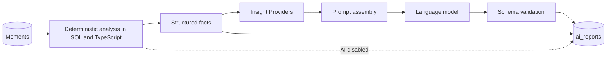

# 15 - PRD: AI Insights Engine

| Field        | Value      |
| ------------ | ---------- |
| Document ID  | DF-DOC-015 |
| Version      | 0.1.0      |
| Status       | Draft      |
| Owner        | Founder    |
| Last updated | 2026-08-04 |

---

## 1. Purpose

What the AI layer does, what it is forbidden from doing, and how it is built so that new
capabilities can be added without disturbing existing ones. The AI is what turns DayFlow
AI from a record into an advisor - and it is also the part with the greatest capacity to
destroy trust, so its limits are specified as precisely as its abilities.

## 2. Boundaries

### 2.1 What the AI may do

Summarise, compare, detect patterns, identify anomalies, recommend, and explain its own
reasoning.

### 2.2 What the AI must never do

| ID        | Prohibition                                                                                            |
| --------- | ------------------------------------------------------------------------------------------------------ |
| DF-AI-001 | The AI MUST NOT create, edit, delete or close a Moment.                                                |
| DF-AI-002 | The AI MUST NOT create, edit or delete Categories, Parent Categories, goals or settings.               |
| DF-AI-003 | The AI MUST NOT compute any statistic. All figures are supplied to it, pre-computed.                   |
| DF-AI-004 | The AI MUST NOT make moral judgements about how the user spends time.                                  |
| DF-AI-005 | The AI MUST NOT offer medical, psychological or clinical advice.                                       |
| DF-AI-006 | The AI MUST NOT be given raw Moment rows, notes or category names beyond what a prompt strictly needs. |
| DF-AI-007 | No user data MUST be used to train any model.                                                          |

DF-AI-003 is ADR-011 and it is the most important line here. A model asked to add up hours
will eventually get it wrong, and a productivity product that misreports the user's own
time has no route back to trust - the user cannot check it independently, which is why they
are using it. The AI receives a summary such as "Learning: 240 minutes, up 34% on last
week" and writes about it. It never sees a row and never does arithmetic.

DF-AI-005 has a practical edge: burnout detection sits close to a clinical claim. The
permitted phrasing is behavioural and observational - "you have recorded work on 19 of the
last 21 days with no full rest day" - never diagnostic.

## 3. Architecture

Two layers, strictly separated.



| ID        | Requirement                                                                                            |
| --------- | ------------------------------------------------------------------------------------------------------ |
| DF-AI-010 | Deterministic analysis MUST run and be useful with AI entirely disabled.                               |
| DF-AI-011 | The AI layer MUST receive only structured, pre-computed facts.                                         |
| DF-AI-012 | Model output MUST be validated against a schema before storage, and rejected output MUST be discarded. |
| DF-AI-013 | A failed or unavailable model MUST degrade to the deterministic report, never to an error page.        |

## 4. Insight Providers

New analysis is added by registering a provider, never by editing an existing one. This is
principle 6 of the charter made concrete.

```typescript
interface InsightProvider {
  id: string;
  periods: Period[];
  minimumDays: number;
  detect(facts: PeriodFacts): DetectedPattern[];
}
```

| ID        | Requirement                                                                             |
| --------- | --------------------------------------------------------------------------------------- |
| DF-AI-020 | Providers MUST be registered in a registry, discovered at runtime.                      |
| DF-AI-021 | A provider MUST declare a minimum days of data below which it does not run.             |
| DF-AI-022 | A provider that throws MUST be skipped, with the report still produced from the rest.   |
| DF-AI-023 | Adding a provider MUST require no change to existing providers or to report generation. |

### 4.1 Providers for 1.0

| Provider              | Minimum data | Detects                                                                                           |
| --------------------- | ------------ | ------------------------------------------------------------------------------------------------- |
| `time-allocation`     | 1 day        | Distribution across parent categories, and the largest shifts against the prior period.           |
| `distraction-pattern` | 7 days       | Distracted time trend, its concentration by hour, and its correlation with low-productivity days. |
| `consistency`         | 14 days      | Which categories occur regularly versus in bursts.                                                |
| `focus-window`        | 14 days      | Hours of day at which the longest uninterrupted Moments occur.                                    |
| `goal-progress`       | 7 days       | Goals trending toward being met or missed, and by how much.                                       |
| `burnout-signal`      | 21 days      | Sustained work volume, absence of rest days, and declining health-category time.                  |
| `habit-formation`     | 21 days      | Categories with a strengthening or decaying daily pattern.                                        |
| `anomaly`             | 14 days      | Days deviating materially from the user's own norm.                                               |

Each is a small, testable function over facts. Their output is the raw material for the
report; the model turns it into language.

## 5. Reports

| Report  | Covers        | Generated                          |
| ------- | ------------- | ---------------------------------- |
| Daily   | One Local Day | After the day ends, or on demand   |
| Weekly  | One week      | After the week ends, or on demand  |
| Monthly | One month     | After the month ends, or on demand |

### 5.1 Structure

Every report contains a two-to-three sentence summary; three to six insights each with a
title, body and supporting figures; one to three recommendations; and the deterministic
statistics that back all of it.

| ID        | Requirement                                                                         |
| --------- | ----------------------------------------------------------------------------------- |
| DF-AI-030 | Reports MUST be stored in `ai_reports` and MUST NOT be regenerated on every view.   |
| DF-AI-031 | The user MUST be able to request regeneration explicitly.                           |
| DF-AI-032 | Every insight MUST cite the figures it rests on, so the user can verify it.         |
| DF-AI-033 | A report MUST state the period and the model that produced it.                      |
| DF-AI-034 | Reports MUST be generated only for periods meeting a minimum of 3 recorded Moments. |
| DF-AI-035 | Generation MUST be schedulable and MUST respect Quiet Hours for its notification.   |
| DF-AI-036 | The user MUST be able to disable each report type independently.                    |

DF-AI-032 is what keeps the AI honest and auditable. An insight reading "your focus is best
in the morning" must carry the evidence: "your 8 longest Moments in the last 14 days all
began between 06:00 and 10:00."

### 5.2 Tone

Observational, specific, and free of judgement. The report describes and suggests; it does
not praise or scold.

| Acceptable                                                                        | Not acceptable                             |
| --------------------------------------------------------------------------------- | ------------------------------------------ |
| "Learning time fell 40% this week, from 6h 20m to 3h 45m."                        | "You slacked off on learning this week."   |
| "Your longest focused sessions began before 10:00 on 8 of the last 10 occasions." | "You should be a morning person."          |
| "Distracted time rose on the four days you recorded work past 20:00."             | "Late work is destroying your discipline." |

## 6. Recommendations

| ID        | Requirement                                                                                            |
| --------- | ------------------------------------------------------------------------------------------------------ |
| DF-AI-040 | Recommendations MUST be specific and actionable, naming a category, a time or a quantity.              |
| DF-AI-041 | Recommendations MUST derive from a detected pattern, never from generic productivity advice.           |
| DF-AI-042 | At most 3 recommendations MUST be offered per report.                                                  |
| DF-AI-043 | The user MUST be able to dismiss a recommendation, and dismissed types SHOULD be de-prioritised later. |
| DF-AI-044 | Recommendations MUST NOT be repeated in consecutive reports unless the pattern strengthened.           |

DF-AI-041 is the difference between a useful product and a fortune cookie. "Try time
blocking" is worthless; "your gym Moments only happen on days you record them before 08:00

- consider scheduling it earlier" is derived from the user's own data.

## 7. Cost and safety

| ID        | Requirement                                                                                 |
| --------- | ------------------------------------------------------------------------------------------- |
| DF-AI-050 | Model calls MUST occur only on the server. No key ever reaches the browser.                 |
| DF-AI-051 | Every call MUST record input tokens, output tokens, model and estimated cost.               |
| DF-AI-052 | A per-user monthly call ceiling MUST be enforced.                                           |
| DF-AI-053 | A global daily spend cap MUST disable AI generation automatically when exceeded.            |
| DF-AI-054 | Prompts MUST be size-capped, and facts truncated to the most significant entries if needed. |
| DF-AI-055 | The provider MUST be swappable by configuration, with no code change.                       |
| DF-AI-056 | `AI_ENABLED=false` MUST disable all generation and hide all AI surfaces.                    |

## 8. Privacy

| ID        | Requirement                                                                                   |
| --------- | --------------------------------------------------------------------------------------------- |
| DF-AI-060 | The user MUST explicitly opt in to AI processing before any data is sent to a model provider. |
| DF-AI-061 | The opt-in MUST state plainly what is sent, to whom, and what is not sent.                    |
| DF-AI-062 | The user MUST be able to withdraw consent, after which no further calls are made.             |
| DF-AI-063 | Moment notes MUST NOT be sent to any model in 1.0.                                            |
| DF-AI-064 | A provider with a no-training guarantee MUST be selected, and the guarantee recorded in       |
|           | [35 - Privacy and Data Protection](../06-operations/35-privacy-and-data-protection.md).       |
| DF-AI-065 | The user MUST be able to delete all stored reports without affecting Moments.                 |

DF-AI-063 is a conservative 1.0 stance: a note can contain anything, including information
about other people, and sending free text to a third party requires more explicit consent
than sending "Learning: 240 minutes".

## 9. Future capabilities

Recorded so the architecture accommodates them, not built in 1.0: natural language search
("how much did I read in March?"), voice capture, predictive reminders based on learned
routine, comparison against anonymised cohorts strictly on opt-in, and a conversational
interface over one's own history.

Each becomes a new Insight Provider or a new endpoint. None requires the data model to
change, which is the test of whether the extensibility claim is real.

## 10. Acceptance criteria

1. With `AI_ENABLED=false`, every analytics feature works and no AI surface is visible.
2. A model failure produces the deterministic report with a notice, never an error page.
3. Every insight in a report cites figures reproducible from the analytics screens.
4. No API key appears in any client bundle.
5. A user who has not opted in has had no data sent to a provider, verifiable in the call log.
6. Registering a new provider requires no edit to any existing provider.
7. A provider that throws is skipped and the report still generates.
8. Exceeding the per-user ceiling disables generation with a clear explanation.
9. Reports are regenerated only when explicitly requested.

---

## Change History

| Version | Date       | Author  | Change         |
| ------- | ---------- | ------- | -------------- |
| 0.1.0   | 2026-08-04 | Founder | Initial draft. |
