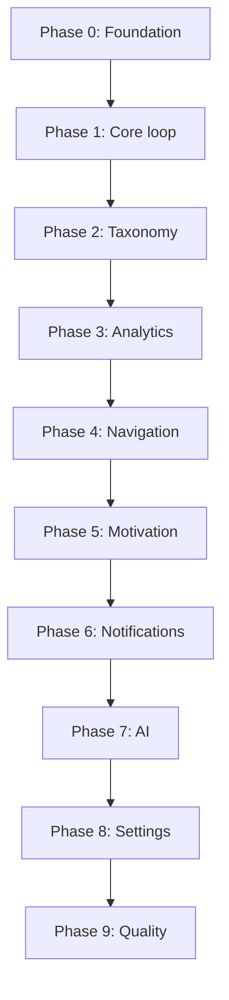

# 17 - Feature Backlog and Roadmap

| Field        | Value      |
| ------------ | ---------- |
| Document ID  | DF-DOC-017 |
| Version      | 0.1.0      |
| Status       | Draft      |
| Owner        | Founder    |
| Last updated | 2026-08-04 |

---

## 1. Purpose

What is being built, in what order, and what is deliberately deferred. This is the only
document in the suite expected to change with every release.

## 2. Build order

The sequence is chosen so that the application becomes genuinely usable as early as
possible, and so that each phase depends only on the ones before it.

### Phase 0 - Foundation

Project scaffold, database schema with row level security, triggers enforcing the queue
and validation rules, seeded defaults, Supabase clients, authentication, realtime
subscriptions, shared Zod schemas, and the application shell with responsive navigation.

**Done when:** a user can sign up, sign in, and see an empty dashboard with their seeded
categories present, on both phone and desktop layouts.

### Phase 1 - Core loop

The Add and Edit Moment form with Now Capture, the pending queue with its enforced limit,
the day timeline, and the dashboard that ties them together.

**Done when:** the founder can use it daily as their real time tracker. This is the point
at which the product exists; everything after it is amplification.

### Phase 2 - Taxonomy

Category and Parent Category management: create, rename, recolour, reorder, archive,
reassign, and the Distracted Time protections.

**Done when:** a user can build a taxonomy that has nothing in common with the defaults.

### Phase 3 - Analytics

All five ranges, composition, distribution, trend, heat map, comparison, the distraction
view, summary statistics, and the four view controls.

**Done when:** a month of real data produces charts worth opening voluntarily.

### Phase 4 - Navigation

Calendar with month grid and day detail, and search across category, parent, date range,
duration and status.

### Phase 5 - Motivation

Goals with all three periods and both directions, streak computation, and the configurable
productivity score.

### Phase 6 - Notifications

Service worker, push subscription management, the reminder job, the long-activity warning,
auto-close, quiet hours, and notification actions.

**Done when:** a Moment left open at 09:00 produces a reminder at 10:00 on a phone with the
app closed, and closing it from the notification works.

### Phase 7 - AI

The deterministic facts layer, the Insight Provider registry with the eight providers,
prompt assembly, schema-validated model output, report storage, and the dashboard insight
card.

### Phase 8 - Settings

Every setting from [16 - PRD Settings and Customization](16-prd-settings-and-customization.md),
account management, export, import and data management.

### Phase 9 - Quality

Unit tests for the domain rules, end-to-end tests for the core journeys, continuous
integration, accessibility audit, performance budgets, and the deployment runbook.

## 3. Version 1.0 scope

Everything in phases 0 through 9. The product ships when all of it works and the founder
has used it continuously for four weeks without losing data or losing the habit.

## 4. Deferred, with reasons

| Feature                          | Deferred to | Reason                                                                                         |
| -------------------------------- | ----------- | ---------------------------------------------------------------------------------------------- |
| Offline write queue              | 1.1         | Real value, real complexity. The read cache covers most of the pain.                           |
| Natural language capture         | 1.2         | Needs a stable data model and a settled category vocabulary first.                             |
| Voice capture                    | 1.2         | Follows natural language.                                                                      |
| Calendar import as suggestions   | 1.2         | Meetings are intentions, not lived time. Useful as prompts, never as data.                     |
| Recurring Moment templates       | 1.1         | Straightforward; simply not essential to the core loop.                                        |
| Sub-categories, a third level    | 1.3         | Two levels have proved sufficient in design. Adding a third is a schema change, not a bolt-on. |
| Shareable summary images         | 1.1         | The intended referral mechanism, so it follows retention being proven.                         |
| Native applications              | 2.0         | Only if PWA push on iOS proves genuinely limiting.                                             |
| Wearable integration             | 2.0         | Interesting, not foundational.                                                                 |
| Anonymised cohort comparison     | 2.0         | Requires scale and a careful privacy design.                                                   |
| Conversational history interface | 2.0         | Depends on the AI layer being mature.                                                          |

## 5. Explicitly never

| Feature                  | Reason                                                     |
| ------------------------ | ---------------------------------------------------------- |
| Team and shared tracking | A different product. See the charter's out-of-scope table. |
| Client billing           | The market deliberately not entered.                       |
| Employer monitoring      | Contradicts charter principle 1 outright.                  |
| Automatic app tracking   | Requires an OS agent and abandons self-declaration.        |
| Advertising              | Contradicts the business model.                            |
| History behind a paywall | A user's own data is never gated.                          |

## 6. Backlog

Not scheduled. Recorded so that ideas are captured rather than lost.

**Capture:** duplicate a previous Moment; split one Moment into two; merge adjacent
Moments of the same category; a widget-style quick-add from the home screen.

**Analysis:** compare any two arbitrary periods; day-of-week patterns; correlation between
any two categories; a personal best board; a year-in-review.

**Motivation:** goal templates; seasonal targets; a rest-day allowance that does not break
a streak.

**Platform:** a public API with personal access tokens; webhooks; iCal export of the
timeline; a command palette.

## 7. Definition of done

A phase is complete only when all of the following hold. This list exists because "done"
otherwise drifts to mean "the happy path works on my laptop".

1. Every requirement identifier in scope is implemented.
2. Rules that must not be bypassable are enforced in the database, not only the client.
3. Unit tests cover the domain rules introduced.
4. The feature works at 320px and at 1920px.
5. The feature is keyboard navigable and screen-reader labelled.
6. Loading, empty and error states all exist.
7. The relevant documents are updated if behaviour changed.
8. `npm run typecheck`, `npm run lint` and `npm run test` all pass.

---

## Change History

| Version | Date       | Author  | Change         |
| ------- | ---------- | ------- | -------------- |
| 0.1.0   | 2026-08-04 | Founder | Initial draft. |
