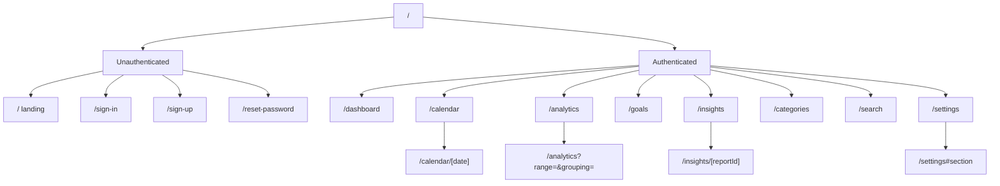

# 18 - Information Architecture

| Field        | Value      |
| ------------ | ---------- |
| Document ID  | DF-DOC-018 |
| Version      | 0.1.0      |
| Status       | Draft      |
| Owner        | Founder    |
| Last updated | 2026-08-04 |

---

## 1. Purpose

How DayFlow AI is organised: what the screens are, how they nest, how navigation differs
between phone and desktop, and what the URL structure is. Route paths defined here are
authoritative for the App Router implementation.

## 2. Structure



## 3. Routes

| Route                  | Screen            | Auth | Purpose                                                           |
| ---------------------- | ----------------- | ---- | ----------------------------------------------------------------- |
| `/`                    | Landing           | no   | Explains the product. Redirects signed-in users to the dashboard. |
| `/sign-in`             | Sign in           | no   | Email and password.                                               |
| `/sign-up`             | Sign up           | no   | Account creation.                                                 |
| `/reset-password`      | Password reset    | no   | Request and completion.                                           |
| `/auth/callback`       | Auth callback     | no   | Supabase redirect handling. No interface.                         |
| `/dashboard`           | Dashboard         | yes  | The default landing surface.                                      |
| `/calendar`            | Calendar          | yes  | Month grid.                                                       |
| `/calendar/[date]`     | Day detail        | yes  | One Local Day, `YYYY-MM-DD`.                                      |
| `/analytics`           | Analytics         | yes  | All charts, controlled by query parameters.                       |
| `/goals`               | Goals and streaks | yes  | Targets and consistency.                                          |
| `/insights`            | Insights          | yes  | AI report list.                                                   |
| `/insights/[reportId]` | Report detail     | yes  | A single report.                                                  |
| `/categories`          | Categories        | yes  | Taxonomy management.                                              |
| `/search`              | Search            | yes  | Filtered Moment search.                                           |
| `/settings`            | Settings          | yes  | All preferences and account management.                           |

Adding and editing a Moment is a modal over the current route rather than a route of its
own, so that capture never loses the user's place. It is addressable as `?moment=new` and
`?moment=<id>` so that a notification can deep-link into it.

## 4. Navigation

### 4.1 Desktop, 1024px and above

A persistent left sidebar 240px wide: brand, primary navigation, a queue indicator showing
free slots, and account access at the foot. Content occupies the remainder, capped at
1280px for readability.

### 4.2 Tablet, 768px to 1023px

The sidebar collapses to a 72px icon rail with labels on hover. Content takes the rest.

### 4.3 Phone, below 768px

A fixed bottom tab bar with five destinations, which is the maximum that remains tappable
at 320px:

| Position | Destination | Icon         |
| -------- | ----------- | ------------ |
| 1        | Dashboard   | Home         |
| 2        | Calendar    | Calendar     |
| 3        | Add Moment  | Plus, raised |
| 4        | Analytics   | Chart        |
| 5        | More        | Menu         |

The centre position is the Add action rather than a destination. Capture is the most
frequent thing a user does, it must be reachable one-handed, and the centre of the bottom
bar is the easiest target for a thumb on any device size.

**More** opens a sheet containing Goals, Insights, Categories, Search and Settings.

| ID        | Requirement                                                                                         |
| --------- | --------------------------------------------------------------------------------------------------- |
| DF-UX-001 | The bottom bar MUST be present on every authenticated route below 768px.                            |
| DF-UX-002 | The bottom bar MUST remain fixed and MUST respect the device safe area inset.                       |
| DF-UX-003 | The active destination MUST be visually indicated.                                                  |
| DF-UX-004 | The Add action MUST open the Moment modal from any route without navigating away.                   |
| DF-UX-005 | Touch targets MUST be at least 44 by 44 CSS pixels.                                                 |
| DF-UX-006 | The queue indicator MUST be visible in the sidebar on desktop and in the dashboard header on phone. |

## 5. Dashboard composition

The dashboard is assembled from sections whose order and visibility the user controls via
`dashboard_order`. Default order:

1. **Queue** - pending Moments, or an invitation to record if empty.
2. **Quick add** - category chips for the most recently used categories.
3. **Today** - timeline for the current Local Day.
4. **Today at a glance** - total recorded, distracted share, productivity score.
5. **Goals** - progress on active daily goals.
6. **Streaks** - current streaks.
7. **Insight** - the most recent AI insight, if enabled.
8. **This week** - a compact stacked bar of the current week.

The queue is first without exception, because it is the only section representing an
outstanding obligation.

## 6. URL state

Analytics state lives in the URL so that a configured view can be bookmarked and returned
to:

```
/analytics?range=weekly&date=2026-08-03&grouping=parent&distraction=show&estimated=include
```

| Parameter     | Values                                             |
| ------------- | -------------------------------------------------- |
| `range`       | `daily`, `weekly`, `monthly`, `yearly`, `lifetime` |
| `date`        | `YYYY-MM-DD`, the anchor within the range          |
| `grouping`    | `parent`, `category`                               |
| `distraction` | `show`, `hide`                                     |
| `estimated`   | `include`, `exclude`                               |

Omitted parameters fall back to the user's configured defaults.

## 7. Deep links

Notification actions and links must land the user exactly where the action is completed:

| Source              | Destination              |
| ------------------- | ------------------------ |
| Queue reminder body | `/dashboard?moment=<id>` |
| Combined reminder   | `/dashboard`             |
| Auto-close notice   | `/dashboard?moment=<id>` |
| Goal reminder       | `/goals`                 |
| Weekly report ready | `/insights/<reportId>`   |

## 8. Empty states

Every screen defines an empty state that teaches rather than apologises. No screen may
show a blank area or a bare "no data" message.

| Screen    | Empty state                                                                             |
| --------- | --------------------------------------------------------------------------------------- |
| Dashboard | Explains Moments and offers to record the first one, pre-filled with a seeded category. |
| Calendar  | Month grid rendered with all days empty and an explanation.                             |
| Analytics | Describes what each chart will show once data exists.                                   |
| Goals     | Explains goals with two concrete examples and a create action.                          |
| Insights  | States how many days of data are needed for the first report.                           |
| Search    | Shows the available filters rather than a blank result area.                            |

## 9. Progressive disclosure

The product has substantial depth, which must not be visible on day one.

| Surface                 | Appears when                                  |
| ----------------------- | --------------------------------------------- |
| Queue explanation       | The first Moment goes pending.                |
| Notification permission | The first Moment goes pending.                |
| Weekly analytics        | 7 days of data exist.                         |
| Monthly analytics       | 30 days of data exist.                        |
| Trend and heat map      | 14 days of data exist.                        |
| AI insights             | Consent given and minimum data met.           |
| Advanced settings       | Behind collapsed sections, closed by default. |

---

## Change History

| Version | Date       | Author  | Change         |
| ------- | ---------- | ------- | -------------- |
| 0.1.0   | 2026-08-04 | Founder | Initial draft. |
