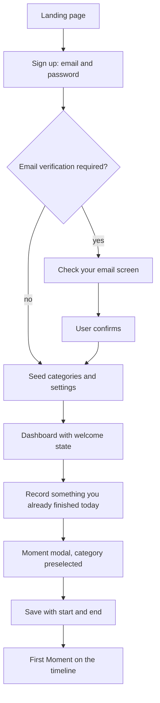
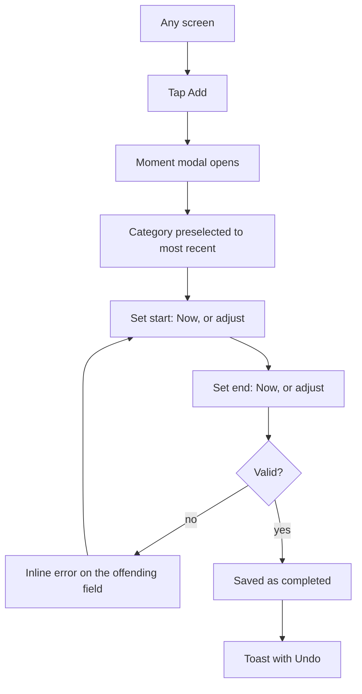
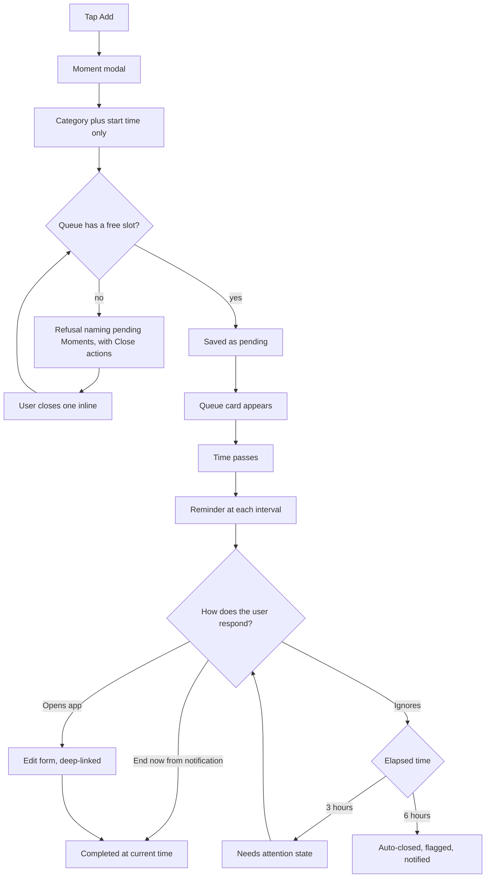
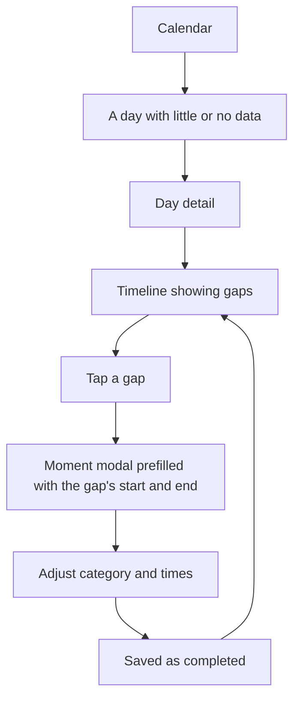
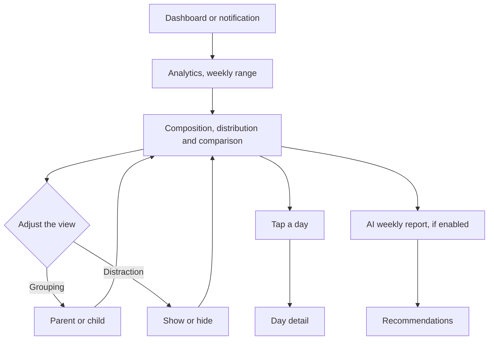
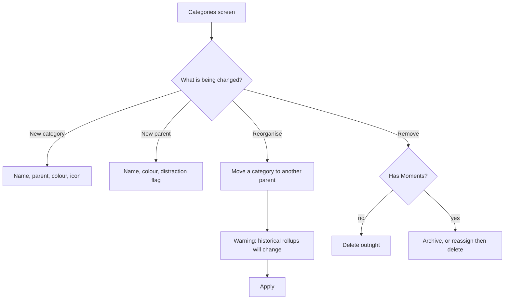
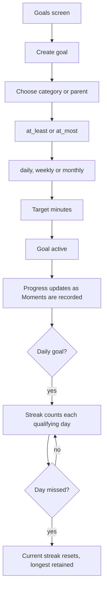
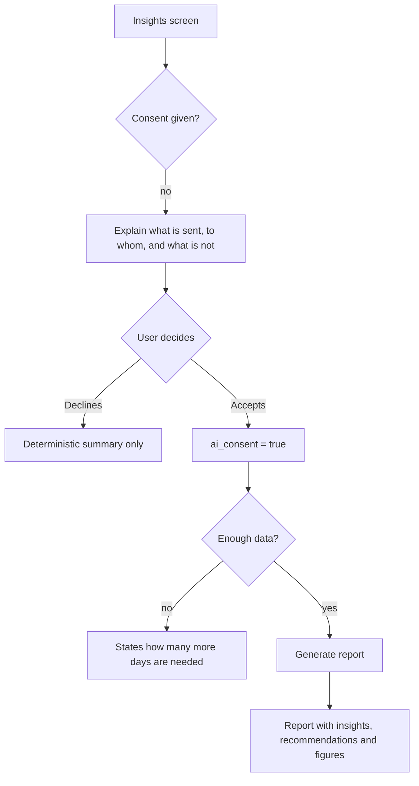
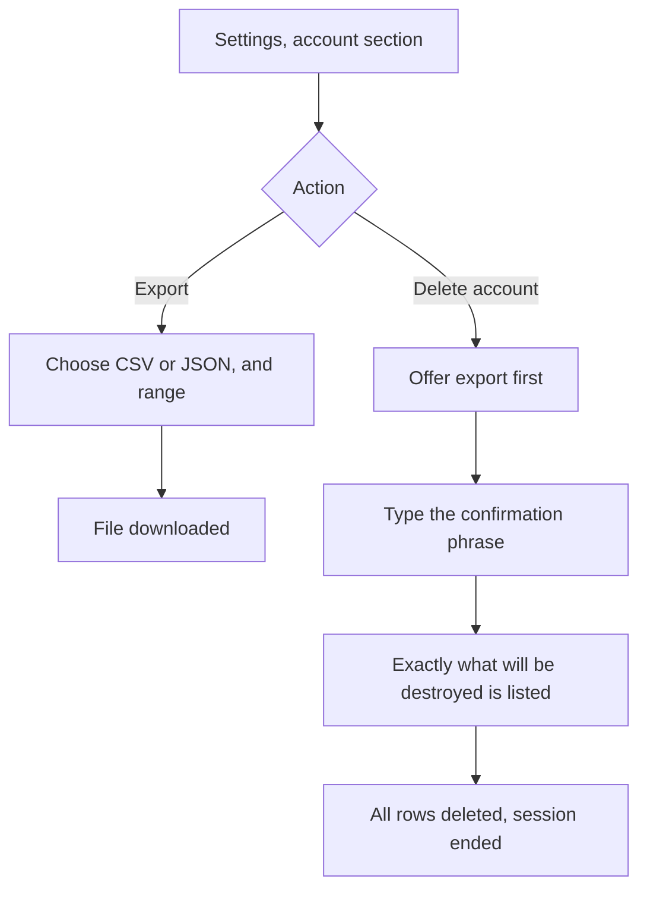

# 19 - User Flows

| Field        | Value      |
| ------------ | ---------- |
| Document ID  | DF-DOC-019 |
| Version      | 0.1.0      |
| Status       | Draft      |
| Owner        | Founder    |
| Last updated | 2026-08-04 |

---

## 1. Purpose

The step-by-step journeys through DayFlow AI, including the failure branches. Flows are
specified before screens because a screen that serves no flow does not need to exist.

## 2. Flow 1 - First run

The most consequential flow in the product. A user who does not record a Moment in their
first session almost never returns.

| ID        | Requirement                                                                                           |
| --------- | ----------------------------------------------------------------------------------------------------- |
| DF-UX-010 | Sign up MUST require only email and password. No survey, no plan choice, no onboarding questionnaire. |
| DF-UX-011 | Categories and settings MUST be seeded before the dashboard first renders, so it is never empty.      |
| DF-UX-012 | The first prompt MUST be for an activity already finished, teaching retroactive capture immediately.  |
| DF-UX-013 | Notification permission MUST NOT be requested during this flow.                                       |
| DF-UX-014 | The user MUST be able to dismiss the welcome prompt and explore freely.                               |

DF-UX-012 is the pedagogical core of onboarding. Asking the user to record something
already finished teaches, in one action, that DayFlow is not a stopwatch.

## 3. Flow 2 - Complete capture

The common case: recording something already finished.

Target: under 10 seconds from tap to saved, per DF-MOM-009.

## 4. Flow 3 - Pending capture and closure

The signature flow, and the reason the product exists.

| ID        | Requirement                                                                      |
| --------- | -------------------------------------------------------------------------------- |
| DF-UX-020 | The refusal MUST list every pending Moment with a one-tap close action.          |
| DF-UX-021 | Data already entered MUST survive the refusal and the inline resolution.         |
| DF-UX-022 | After closing one inline, the pending save MUST be retried automatically.        |
| DF-UX-023 | The queue explanation MUST be shown once, the first time a Moment goes pending.  |
| DF-UX-024 | Notification permission MUST be requested at this point, with the reason stated. |

DF-UX-021 and DF-UX-022 are what make a hard limit tolerable. The user experiences it as
"close one first", not as lost work.

## 5. Flow 4 - Filling in a forgotten day

The recovery flow. Users will forget entire days, and the product must make repair easy
rather than shameful.

Prefilling from the gap is the important detail: it turns reconstructing a day from a
typing exercise into a series of taps.

## 6. Flow 5 - Weekly review

Where the product delivers on its promise.

## 7. Flow 6 - Building a taxonomy

## 8. Flow 7 - Goals and streaks

## 9. Flow 8 - Enabling AI

The declining branch must remain genuinely useful. A user who refuses AI keeps a complete
product, per DF-AI-010.

## 10. Flow 9 - Data export and account deletion

## 11. Error handling across all flows

| Situation             | Behaviour                                                                             |
| --------------------- | ------------------------------------------------------------------------------------- |
| Network unavailable   | Cached data remains readable; writes show a clear failure with retry. No silent loss. |
| Validation failure    | Inline, on the offending field, phrased as what to do rather than what went wrong.    |
| Queue full            | Refusal with inline resolution, per flow 3.                                           |
| Session expired       | Redirect to sign in, returning to the same route afterwards.                          |
| Server error          | Human-readable message with a retry action and a support route.                       |
| Realtime disconnected | Silent reconnect, with an indicator only if it persists beyond 30 seconds.            |

| ID        | Requirement                                                                             |
| --------- | --------------------------------------------------------------------------------------- |
| DF-UX-030 | No error message MUST expose a stack trace, a database error or an internal identifier. |
| DF-UX-031 | Every error MUST offer a next action.                                                   |
| DF-UX-032 | A failed write MUST NOT discard the user's entered data.                                |

---

## Change History

| Version | Date       | Author  | Change         |
| ------- | ---------- | ------- | -------------- |
| 0.1.0   | 2026-08-04 | Founder | Initial draft. |
