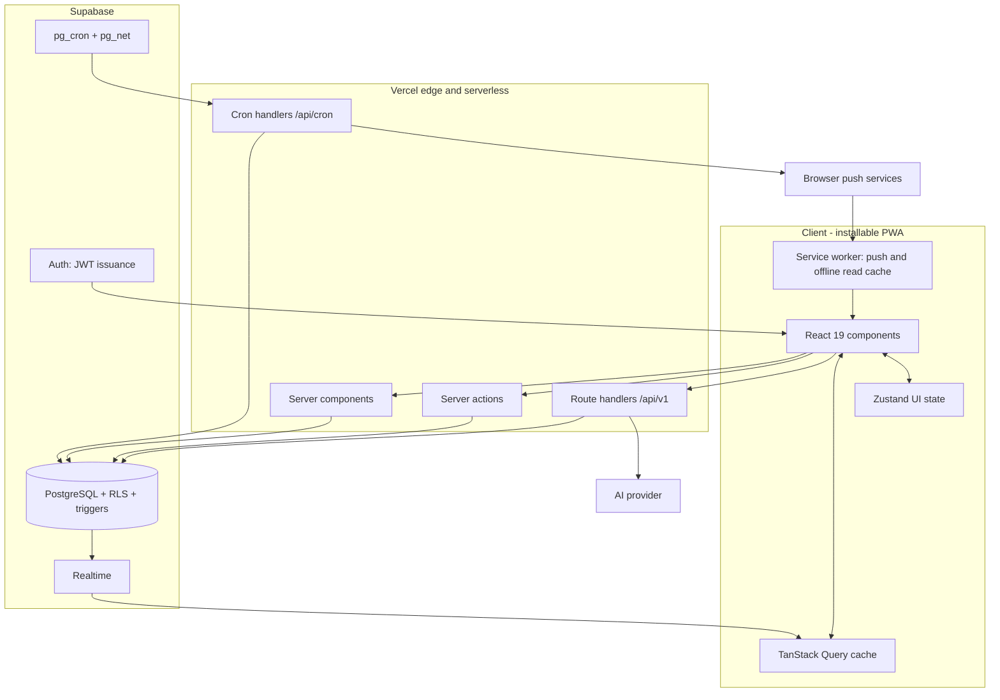
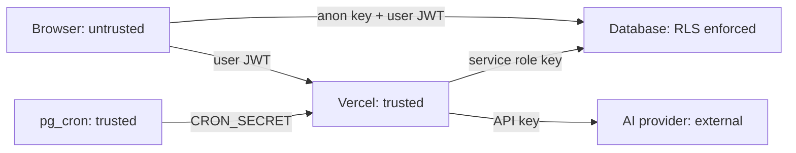
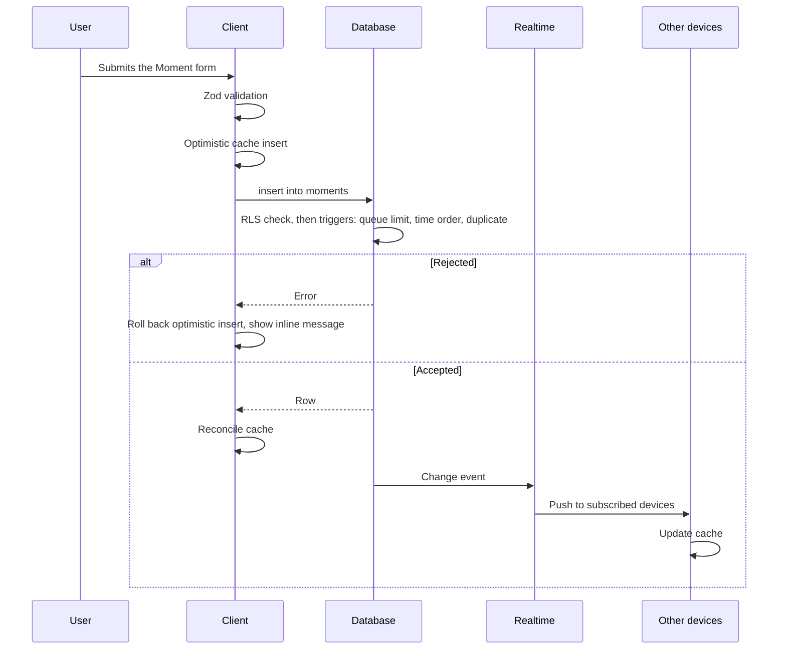

# 23 - System Architecture

| Field        | Value      |
| ------------ | ---------- |
| Document ID  | DF-DOC-023 |
| Version      | 0.2.0      |
| Status       | Draft      |
| Owner        | Founder    |
| Last updated | 2026-08-04 |

---

## 1. Purpose

The whole system in one view: components, boundaries, trust model, data flow and the
reasoning behind the arrangement. Individual subsystems are detailed in documents 24 to 29.

## 2. Overview



## 3. Components

### 3.1 Client

A Next.js App Router application. Server components fetch the initial data for a route, so
first paint carries real content rather than a spinner. Client components handle
interaction, and subscribe to Realtime to stay current.

Two distinct kinds of state, deliberately separated:

- **Server state** - Moments, categories, settings, reports. Owned by TanStack Query,
  which handles caching, refetching and invalidation.
- **UI state** - open modals, selected range, sheet visibility. Owned by Zustand.

Conflating these is the most common source of state bugs in applications of this shape:
server data ends up copied into component state, and then two sources of truth drift apart.

### 3.2 Server

| Surface           | Used for                                                              |
| ----------------- | --------------------------------------------------------------------- |
| Server components | Initial data fetch for a route                                        |
| Server actions    | Form mutations invoked directly from components                       |
| Route handlers    | Programmatic API, push subscription management, AI generation, export |
| Cron handlers     | Reminder evaluation, auto-close, report generation                    |

Simple reads and writes go directly from the client to Supabase using the anon key, since
RLS makes that safe. Server routes exist only where something more than a table operation
is required: a secret must be used, work must span users, or an external service is called.

This is a deliberate reduction in moving parts. A hand-written CRUD endpoint that only
re-implements what RLS already enforces adds latency, code and a second place for bugs.

### 3.3 Database

PostgreSQL with row level security on every table, triggers enforcing the domain
invariants, generated columns for derived values, and SQL functions for aggregation.

The database is not a passive store. It is where correctness lives, per ADR-004.

### 3.4 Scheduling

`pg_cron` runs inside Supabase and uses `pg_net` to call the application's cron endpoints
over HTTPS with a bearer secret. Vercel Cron handles the single daily job. Rationale in
ADR-008.

## 4. Trust boundaries



| Boundary            | Control                                                                    |
| ------------------- | -------------------------------------------------------------------------- |
| Browser to database | Anon key plus user JWT. RLS restricts every row to its owner.              |
| Browser to server   | Session cookie validated on every request.                                 |
| Server to database  | Service role key, used only where cross-user access is genuinely required. |
| Scheduler to server | Bearer `CRON_SECRET`, compared in constant time.                           |
| Server to AI        | Provider key, server-side only, never in a client bundle.                  |

**The anon key is public by design.** It identifies the project, not the user.
Authorisation comes entirely from the JWT plus RLS. This is only safe if RLS is correct on
every table without exception, which is why
[25 - Database Schema and RLS](25-database-schema-and-rls.md) treats a table without a
policy as a critical defect rather than an oversight.

## 5. Data flow: creating a Moment



The optimistic insert makes capture feel instantaneous, which matters because DF-MOM-009
sets a ten-second budget for the whole interaction. The rollback path is what keeps that
honest when the database refuses.

## 6. Aggregation

All aggregation happens in the database, per DF-ANA-092. SQL functions accept a user, a
range and grouping options, and return aggregated rows.

Overnight Moments are handled by interval intersection, which is how ADR-010's midnight
split is implemented: a Moment contributes only the part of itself that falls inside the
boundary being measured, so one running from 22:30 to 01:30 gives ninety minutes to each of
two days rather than a hundred and eighty to the first.

```sql
sum(
  extract(epoch from (
    least(coalesce(m.end_at, now()), day_end) - greatest(m.start_at, day_start)
  )) / 60
)
```

The `coalesce` is not decoration. A pending Moment has no `end_at`, and `least` skips nulls
rather than returning one, so without it an open Moment would be credited with every
remaining minute of the boundary instead of stopping at the present instant.

**That expression is written out separately in five function bodies** in
[`0010_analytics_functions.sql`](../../supabase/migrations/0010_analytics_functions.sql):
`get_time_by_category`, `get_daily_totals`, `get_day_breakdown`, `get_goal_achieved` and
`get_productivity_score`. Each clamps to the boundaries it measures against - every Local
Day of the requested series in `get_daily_totals`, a single Local Day in `get_day_breakdown`
and `get_productivity_score`, the two ends of the range in `get_time_by_category` and
`get_goal_achieved`. Only two functions build on another rather than repeating it:
`get_streak` calls `get_goal_achieved`, and `get_period_facts` calls `get_daily_totals` and
`get_time_by_category`.

Changing the split rule is therefore a five-function edit, and the five are named here so
that finding them is not left as an exercise. Someone who changes one and stops has
corrupted four aggregations that still execute and still return plausible numbers, and that
disagree with each other only for the users who record across midnight.

The duplication is a maintenance hazard, and consolidating the expression behind a single
helper is worth doing. It has not been done because `0010` is applied to the live database
and is therefore immutable: consolidation means a new migration replacing five functions at
once, which carries its own risk and belongs in
[04 - Decision Log](../00-governance/04-decision-log.md) as a decision rather than arriving
as an incidental refactor.

Sending raw Moments to the client and summing them there would be simpler to write and
would fail immediately at lifetime range, where a three-year user has tens of thousands of
rows.

## 7. Offline behaviour

1.0 supports offline **reading** only.

The service worker caches the application shell and the most recent responses, so a user
without connectivity can still see today and this week. Writes require connectivity and
fail with a clear, retryable error that preserves entered data, per DF-UX-032.

Offline writes are deferred to 1.1 because a write queue needs conflict resolution against
database-side rules such as the queue limit - the queue could be full by the time a queued
write is replayed, and resolving that correctly is a design problem, not a coding one.

## 8. Failure modes

| Failure               | Consequence              | Response                                                           |
| --------------------- | ------------------------ | ------------------------------------------------------------------ |
| Supabase unavailable  | No reads or writes       | Cached reads continue; writes show a retryable error.              |
| Realtime disconnected | Devices drift apart      | Automatic reconnect; polling fallback; indicator after 30s.        |
| Vercel function error | Affected route fails     | Error boundary with retry; core capture path avoids server routes. |
| pg_cron not firing    | No reminders             | Heartbeat monitoring; alert on missed runs.                        |
| Push service rejects  | A device stops receiving | 404 and 410 responses delete the subscription automatically.       |
| AI provider down      | No new reports           | Degrade to deterministic report, per DF-AI-013.                    |
| AI returns bad JSON   | Report cannot be built   | Schema validation rejects it; one retry; then degrade.             |

The pattern throughout: no failure of a peripheral system may prevent the user from
recording a Moment. Capture is the one path that must always work.

## 9. Scaling

At the intended scale - one user to a few thousand - nothing here is stressed. The
architecture nonetheless has a clear path: indexes on `(user_id, start_at)` cover every
range query; aggregation is already server-side; materialised daily rollups can be
introduced behind the existing SQL functions without touching the client; and read replicas
are available on paid Supabase tiers.

The first thing to break at scale would be per-request aggregation over multi-year
lifetime ranges, and the fix for that is a rollup table that the existing function
signatures can hide entirely.

## 10. Extension points

| Extension             | Mechanism                                                |
| --------------------- | -------------------------------------------------------- |
| New AI insight        | Register an `InsightProvider`. No existing code changes. |
| New chart             | Add a component plus an aggregation function.            |
| New notification type | Add a template plus a settings flag.                     |
| New integration       | Add a route handler under `/api/v1`.                     |
| Schema change         | A numbered migration, expand-then-contract.              |
| Gradual rollout       | A row in `feature_flags`.                                |

---

## Change History

| Version | Date       | Author  | Change                                                                                                                                                                                                                                                                                                                                                                                                 |
| ------- | ---------- | ------- | ------------------------------------------------------------------------------------------------------------------------------------------------------------------------------------------------------------------------------------------------------------------------------------------------------------------------------------------------------------------------------------------------------ |
| 0.1.0   | 2026-08-04 | Founder | Initial draft.                                                                                                                                                                                                                                                                                                                                                                                         |
| 0.2.0   | 2026-08-04 | Founder | Corrected section 6, which said ADR-010's midnight split was applied in one place rather than reimplemented per chart. The intersection expression is written out in five analytics functions, now named, with the boundaries each clamps to; the `coalesce` on `end_at` was restored to the quoted expression; and the duplication is recorded as a consolidation candidate needing its own decision. |
