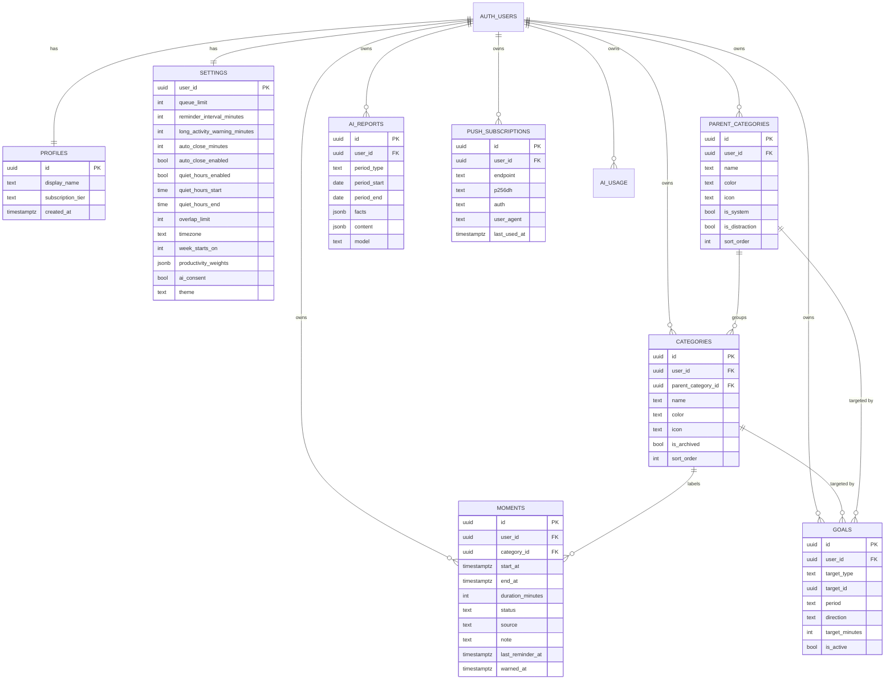

# 24 - Data Model and ERD

| Field        | Value      |
| ------------ | ---------- |
| Document ID  | DF-DOC-024 |
| Version      | 0.1.0      |
| Status       | Draft      |
| Owner        | Founder    |
| Last updated | 2026-08-04 |

---

## 1. Purpose

The entities, their relationships, and the modelling decisions behind them. The executable
form is in [25 - Database Schema and RLS](25-database-schema-and-rls.md); this document
explains why the schema looks the way it does.

## 2. Entity relationship diagram



## 3. Modelling decisions

### 3.1 Two levels of taxonomy, not arbitrary nesting

Categories belong to Parent Categories, and that is the whole hierarchy. A general tree
would be more flexible and considerably worse: recursive queries for every rollup, an
"which level am I looking at?" problem in every chart, and a user interface that invites
people to build six-level taxonomies they will not maintain.

Two levels covers every use case found in
[07 - Personas and Jobs to be Done](../01-business/07-personas-and-jobs-to-be-done.md). A
third level is deferred to 1.3 and would be a schema change, not a bolt-on.

### 3.2 `user_id` denormalised onto every table

`categories.user_id` is redundant - it could be derived through `parent_category_id`. It is
stored anyway for two reasons: RLS policies become a single-column comparison rather than a
join, which matters because a policy runs on every row of every query; and it makes
accidental cross-user references structurally impossible rather than merely unlikely.

A composite foreign key ensures the redundancy can never become inconsistent:

```sql
foreign key (parent_category_id, user_id)
  references parent_categories (id, user_id)
```

This is the crucial detail. Without it, a bug could attach one user's category to another
user's parent, and RLS would not catch it because each row individually looks correct.

### 3.3 `duration_minutes` is generated, never written

```sql
duration_minutes integer generated always as (
  case when end_at is null then null
  else floor(extract(epoch from (end_at - start_at)) / 60)::integer end
) stored
```

A stored generated column cannot drift from the timestamps, is indexable for
duration-based search, and needs no trigger. The alternative - maintaining it in
application code - guarantees that some path will eventually update a timestamp without
updating the duration.

### 3.4 Status as an enumerated type

`pending`, `completed`, `auto_closed`. Deriving status from `end_at is null` would collapse
`completed` and `auto_closed` into one, losing the distinction ADR-013 requires. A check
constraint keeps status and timestamps consistent:

```sql
check (
  (status = 'pending' and end_at is null) or
  (status in ('completed','auto_closed') and end_at is not null)
)
```

### 3.5 The queue is a view, not a table

Pending Moments are `moments where status = 'pending'`. A separate queue table would be a
second source of truth requiring synchronisation, and would eventually disagree with
`moments` after some partial failure.

### 3.6 Reminder bookkeeping on the Moment

`last_reminder_at` and `warned_at` live on `moments` rather than in a separate schedule
table. The reminder job is a query over pending Moments, and keeping the bookkeeping on the
row makes the job idempotent by construction, satisfying DF-REM-010.

### 3.7 Settings as one wide row per user

One row per user with a column per setting, rather than a key-value table. Types are
enforced by the column, ranges by check constraints, defaults by the schema, and reading
all settings is one row with no pivoting. The cost is a migration per new setting, which is
correct - a new setting is a deliberate product change and should be visible in the
migration history.

`productivity_weights` is the single exception, stored as `jsonb`, because its keys are
user-created Parent Category identifiers and therefore cannot be columns.

### 3.8 Streaks are computed, not stored

Streaks are derived from Moments and goals on demand. Storing them would create a cache
that must be invalidated whenever any historical Moment changes - and DF-GOA-035 requires
that editing a Moment from three days ago correctly repairs the streak. Computation in SQL
over an indexed range is fast enough at personal scale.

If a rollup ever becomes necessary, it goes behind the existing function signature.

### 3.9 AI reports store their own inputs

`ai_reports` keeps both `facts` (the deterministic statistics) and `content` (the generated
narrative). Storing the facts means a report remains verifiable and re-renderable years
later, even if the aggregation logic changes or the model is retired.

## 4. Key relationships and integrity

| Relationship                  | Cardinality | On delete                                        |
| ----------------------------- | ----------- | ------------------------------------------------ |
| user to profile               | 1:1         | cascade                                          |
| user to settings              | 1:1         | cascade                                          |
| user to parent categories     | 1:N         | cascade                                          |
| parent category to categories | 1:N         | restrict - reassignment required, per DF-CAT-022 |
| category to moments           | 1:N         | restrict - archive or reassign, per DF-CAT-005   |
| user to moments               | 1:N         | cascade                                          |
| user to goals                 | 1:N         | cascade                                          |

The two `restrict` relationships are the schema-level expression of the product rule that
history must not be destroyed as a side effect of tidying up a taxonomy.

## 5. Indexing

| Index                                              | Serves                               |
| -------------------------------------------------- | ------------------------------------ |
| `moments (user_id, start_at desc)`                 | Every range query and the timeline   |
| `moments (user_id, status) where status='pending'` | The queue and the reminder job       |
| `moments (user_id, category_id, start_at)`         | Category filtering and goal progress |
| `categories (user_id, parent_category_id)`         | Taxonomy rendering and rollups       |
| `goals (user_id) where is_active`                  | Active goal evaluation               |
| `ai_reports (user_id, period_type, period_start)`  | Report lookup                        |
| `push_subscriptions (user_id)`                     | Notification fan-out                 |

The partial index on pending Moments matters disproportionately: the reminder job runs
every ten minutes across all users, and pending Moments are a tiny fraction of the table.

## 6. Data volumes

A committed user recording eight Moments a day produces roughly 2,900 rows a year - about
350KB. A thousand such users after three years is under one gigabyte. The data model is not
the scaling constraint at any plausible scale for this product.

## 7. Retention

Moments are retained indefinitely; deletion is always a user action. AI reports are
retained until deleted by the user. Push subscriptions are removed automatically when the
push service reports them gone. AI usage records are kept for twelve months for cost
analysis. Account deletion cascades across every table.

---

## Change History

| Version | Date       | Author  | Change         |
| ------- | ---------- | ------- | -------------- |
| 0.1.0   | 2026-08-04 | Founder | Initial draft. |
