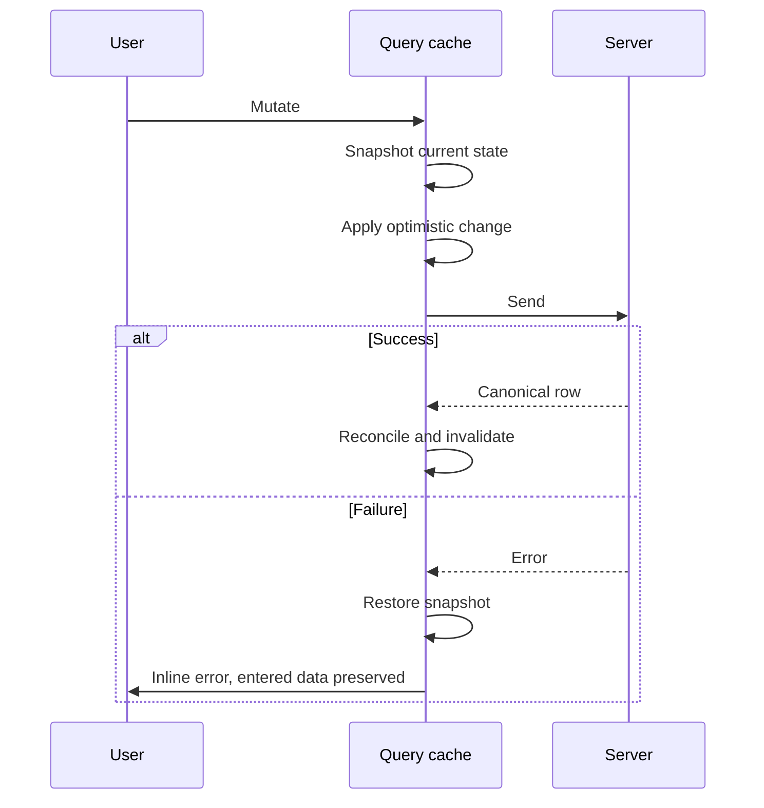
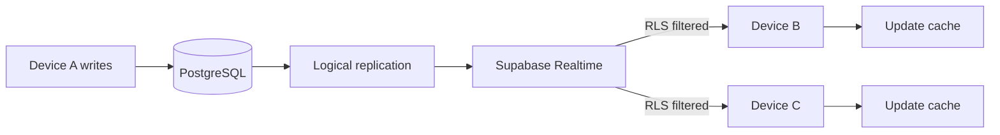

# 27 - State and Sync Strategy

| Field        | Value      |
| ------------ | ---------- |
| Document ID  | DF-DOC-027 |
| Version      | 0.1.0      |
| Status       | Draft      |
| Owner        | Founder    |
| Last updated | 2026-08-04 |

---

## 1. Purpose

How state is held on the client, how devices stay in agreement, how conflicts are resolved,
and what happens offline. Multi-device synchronisation was one of the two requirements that
forced the move to a cloud database in ADR-001, so it has to actually work.

## 2. State categories

| Category        | Examples                                      | Owner          | Persisted         |
| --------------- | --------------------------------------------- | -------------- | ----------------- |
| Server state    | Moments, categories, settings, goals, reports | TanStack Query | Database          |
| UI state        | Open modal, selected range, sheet visibility  | Zustand        | Session, some URL |
| Ephemeral state | Form fields before submit                     | React          | Not persisted     |
| Device state    | Theme before first sync, last route           | Zustand        | `localStorage`    |

**Server state is never copied into component state.** This is the single most important
rule in this document. Copying it creates a second source of truth that drifts the moment
another device changes something, and it is the origin of most "the UI is showing stale
data" bugs in applications of this shape.

## 3. Query keys

A consistent, hierarchical key structure so that invalidation can be targeted precisely
rather than blowing away the whole cache:

```typescript
["moments", "list", { from, to }][("moments", "pending")][("moments", "detail", id)][
  ("categories", "list")
][("parentCategories", "list")]["settings"][("goals", "list")][
  ("analytics", range, date, grouping, options)
][("reports", "list")];
```

| ID         | Requirement                                                         |
| ---------- | ------------------------------------------------------------------- |
| DF-SYN-001 | Keys MUST be produced by a central factory, never assembled inline. |
| DF-SYN-002 | Invalidation MUST target the narrowest key that covers the change.  |

## 4. Cache policy

| Data               | Stale after | Cached for | Refetch on focus |
| ------------------ | ----------- | ---------- | ---------------- |
| Pending Moments    | 30s         | 5 min      | yes              |
| Today's Moments    | 60s         | 10 min     | yes              |
| Historical Moments | 5 min       | 30 min     | no               |
| Categories         | 10 min      | 60 min     | no               |
| Settings           | 10 min      | 60 min     | no               |
| Analytics          | 5 min       | 30 min     | no               |
| AI reports         | infinite    | infinite   | no               |

Historical data does not refetch on focus because it does not change on its own; refetching
it would be pure waste. Pending Moments are the most volatile thing in the product and are
treated accordingly.

## 5. Optimistic updates

Capture must feel instant to meet the ten-second budget of DF-MOM-009, so mutations apply
optimistically.



| ID         | Requirement                                                                                        |
| ---------- | -------------------------------------------------------------------------------------------------- |
| DF-SYN-010 | Create, close and delete of Moments MUST be optimistic.                                            |
| DF-SYN-011 | A failed mutation MUST fully roll back the optimistic change.                                      |
| DF-SYN-012 | A rollback MUST NOT discard the user's entered form data.                                          |
| DF-SYN-013 | The queue limit MUST be checked client-side before an optimistic insert, to avoid a visible flash. |

DF-SYN-013 matters for perceived quality: without it, a refused third Moment would appear in
the queue for 200 milliseconds and then vanish, which reads as a bug even though the outcome
is correct.

## 6. Realtime synchronisation



Subscriptions are per-table, filtered to the user's own rows. Realtime applies RLS to the
stream, so a device can only ever receive changes to rows it is permitted to read.

| ID         | Requirement                                                                                      |
| ---------- | ------------------------------------------------------------------------------------------------ |
| DF-SYN-020 | Signed-in clients MUST subscribe to `moments`, `categories`, `parent_categories` and `settings`. |
| DF-SYN-021 | Received changes MUST update the cache without a refetch where the payload is sufficient.        |
| DF-SYN-022 | Changes MUST propagate to other devices within 5 seconds at p95.                                 |
| DF-SYN-023 | Subscriptions MUST reconnect automatically with exponential backoff.                             |
| DF-SYN-024 | On reconnect, affected queries MUST be invalidated to recover anything missed while offline.     |
| DF-SYN-025 | A disconnection lasting over 30 seconds MUST be indicated in the interface.                      |
| DF-SYN-026 | Subscriptions MUST be torn down on sign-out.                                                     |

DF-SYN-024 is essential and easy to overlook. Realtime does not replay events missed while
disconnected, so without a refetch on reconnect a device silently keeps stale data.

## 7. Conflict resolution

Two devices can edit the same Moment. Resolution is last-write-wins at row granularity,
because the database applies writes serially and the later one prevails.

This is acceptable here, and it is worth being explicit about why rather than pretending it
is a general solution. DayFlow is single-user: the two "conflicting" devices belong to the
same person, who is doing one thing at a time. The realistic conflict is closing the same
Moment from a phone notification and a laptop within seconds - and both writes produce
nearly the same result.

| ID         | Requirement                                                                                       |
| ---------- | ------------------------------------------------------------------------------------------------- |
| DF-SYN-030 | Row-level last-write-wins MUST be the resolution strategy.                                        |
| DF-SYN-031 | Closing an already-closed Moment MUST be idempotent, not an error.                                |
| DF-SYN-032 | An update to a deleted Moment MUST surface a clear "no longer exists" message.                    |
| DF-SYN-033 | The queue limit MUST be evaluated at the database, so two devices cannot both pass a stale check. |

DF-SYN-033 is exactly the scenario ADR-004 was written for: two devices each see one free
slot, each creates a Moment, and only the database can arbitrate. A client-side check alone
would allow three pending Moments to exist.

## 8. Offline

1.0 is read-only offline, per section 7 of
[23 - System Architecture](23-system-architecture.md).

| ID         | Requirement                                                                  |
| ---------- | ---------------------------------------------------------------------------- |
| DF-SYN-040 | The application shell MUST be cached and load without a network.             |
| DF-SYN-041 | Today's and this week's data MUST remain readable offline.                   |
| DF-SYN-042 | Offline MUST be clearly indicated.                                           |
| DF-SYN-043 | A write attempted offline MUST fail visibly and MUST preserve entered data.  |
| DF-SYN-044 | Cached data older than the current session MUST be marked as possibly stale. |

DF-SYN-043 is deliberately blunt. Silently accepting a write that will never be persisted is
the worst possible behaviour - the user believes their evening is recorded and it is not.

## 9. Session

Supabase issues a JWT with a refresh token. Middleware refreshes the session on navigation.
Expiry redirects to sign-in and returns the user to their original route afterwards. Signing
out clears the cache, tears down subscriptions and clears device state except the theme.

| ID         | Requirement                                                                    |
| ---------- | ------------------------------------------------------------------------------ |
| DF-SYN-050 | Sessions MUST refresh transparently without interrupting the user.             |
| DF-SYN-051 | Expiry MUST return the user to the route they were on after re-authentication. |
| DF-SYN-052 | Sign-out MUST clear all cached user data from the device.                      |

---

## Change History

| Version | Date       | Author  | Change         |
| ------- | ---------- | ------- | -------------- |
| 0.1.0   | 2026-08-04 | Founder | Initial draft. |
