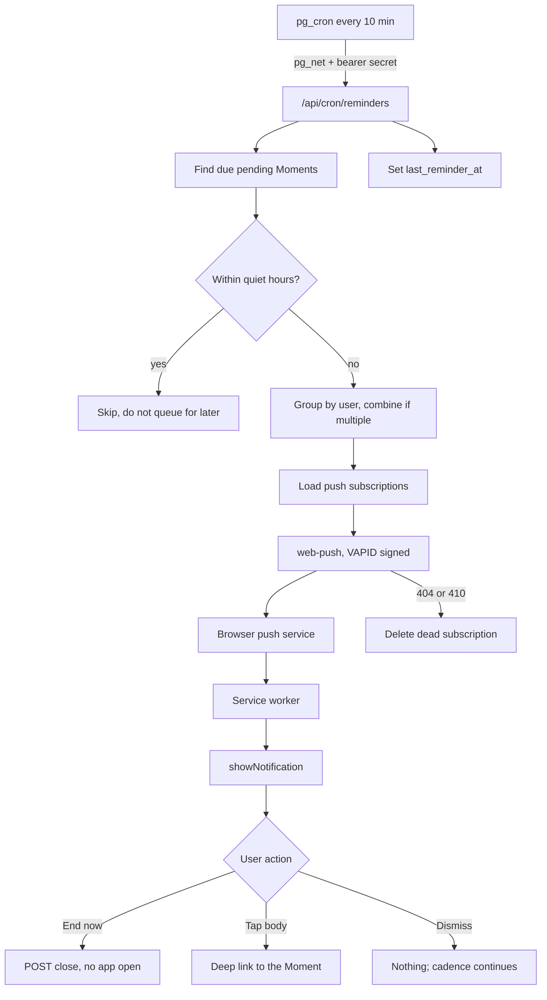
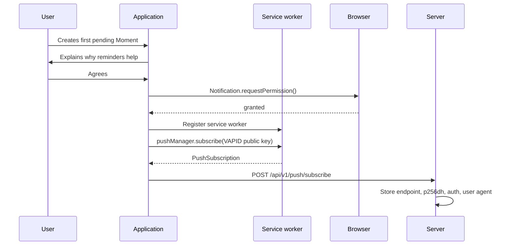

# 28 - Notification Architecture

| Field        | Value      |
| ------------ | ---------- |
| Document ID  | DF-DOC-028 |
| Version      | 0.1.0      |
| Status       | Draft      |
| Owner        | Founder    |
| Last updated | 2026-08-04 |

---

## 1. Purpose

How notifications are scheduled, produced, delivered and acted on. Reminders are what make
the queue mechanic work rather than merely exist, so this subsystem is load-bearing for the
product's central claim.

## 2. Overview

## 3. Why this arrangement

Three constraints shaped it.

**Reminders must fire when the app is closed.** That rules out any client-side timer. A
`setTimeout` in a page only runs while the page is open, which is precisely when the user
does not need reminding.

**The schedule must run without an always-on server.** ADR-008: Vercel's Hobby plan permits
one cron run per day, so `pg_cron` inside Supabase drives the ten-minute cadence and calls
the application over HTTPS.

**External triggering means duplicate delivery is inevitable.** Any HTTP-triggered job will
eventually be invoked twice, so idempotency is designed in rather than hoped for, via
`last_reminder_at` on the Moment.

## 4. Push subscription lifecycle

| ID         | Requirement                                                                                 |
| ---------- | ------------------------------------------------------------------------------------------- |
| DF-NOT-001 | Permission MUST be requested only after the first pending Moment exists, never at signup.   |
| DF-NOT-002 | The request MUST be preceded by an explanation of what will be sent and how often.          |
| DF-NOT-003 | Denial MUST leave the product fully functional, with in-app reminders instead.              |
| DF-NOT-004 | Subscriptions MUST be unique by endpoint, so re-subscribing updates rather than duplicates. |
| DF-NOT-005 | The user MUST be able to list and revoke devices.                                           |
| DF-NOT-006 | 404 and 410 responses from a push service MUST delete the subscription immediately.         |

DF-NOT-001 and DF-NOT-002 exist because a permission prompt shown before the user
understands the product is the most reliable way to earn a permanent denial - and browsers
do not offer a second chance.

## 5. Reminder job

Runs every ten minutes. The cadence is finer than the default one-hour interval so that
users on a shorter interval are served accurately.

Selection criteria: `status = 'pending'`, the owner has `reminders_enabled`, and
`last_reminder_at` is either null and `start_at` is at least one interval ago, or is itself
at least one interval ago.

The first condition implements DF-REM-003: the first reminder arrives one interval after the
Moment starts, not immediately, because reminding someone about something they recorded
ninety seconds ago is noise.

| ID         | Requirement                                                                   |
| ---------- | ----------------------------------------------------------------------------- |
| DF-NOT-010 | The job MUST use the service role key, since it acts across all users.        |
| DF-NOT-011 | It MUST evaluate quiet hours in each user's own timezone.                     |
| DF-NOT-012 | It MUST combine multiple due Moments for one user into a single notification. |
| DF-NOT-013 | It MUST set `last_reminder_at` in the same transaction as a successful send.  |
| DF-NOT-014 | A failure for one user MUST NOT abort the run.                                |
| DF-NOT-015 | It MUST complete within 60 seconds or checkpoint and resume.                  |
| DF-NOT-016 | It MUST log counts of evaluated, sent, skipped and failed.                    |

## 6. Auto-close job

Runs every fifteen minutes. Selects pending Moments where
`now() - start_at > auto_close_minutes` and the owner has `auto_close_enabled`.

For each: set `end_at = start_at + auto_close_minutes`, `status = 'auto_closed'`,
`source = 'auto_close'`, then notify unless quiet hours apply.

| ID         | Requirement                                                                        |
| ---------- | ---------------------------------------------------------------------------------- |
| DF-NOT-020 | The close MUST occur even during quiet hours; only its notification is suppressed. |
| DF-NOT-021 | The notification MUST explain the reason and link directly to correction.          |
| DF-NOT-022 | The slot MUST be freed immediately.                                                |
| DF-NOT-023 | Users with auto-close disabled MUST be skipped entirely.                           |

DF-NOT-020 implements DF-SET-014. Delaying the close until quiet hours end would produce a
nine-hour Moment purely because it happened overnight, which is the opposite of the
intended behaviour.

## 7. Long activity warning

Evaluated by the reminder job rather than a separate schedule. A pending Moment past
`long_activity_warning_minutes` with `warned_at` null receives one higher-urgency
notification, and `warned_at` is stamped so it fires exactly once.

## 8. Notification catalogue

| Type              | Trigger                      | Title                     | Actions       |
| ----------------- | ---------------------------- | ------------------------- | ------------- |
| Queue reminder    | Interval elapsed             | "Still on Python?"        | End now, Open |
| Combined reminder | Multiple due                 | "2 activities still open" | Open          |
| Long activity     | Warning threshold crossed    | "Python running 3h 2m"    | End now, Open |
| Auto-closed       | Auto-close threshold crossed | "Python was closed"       | Fix end time  |
| Goal reminder     | Configured time, goal unmet  | "45m of reading left"     | Open          |
| Weekly report     | Report generated             | "Your week is ready"      | Read          |
| Achievement       | Personal best or milestone   | "30-day gym streak"       | Open          |

| ID         | Requirement                                                                                              |
| ---------- | -------------------------------------------------------------------------------------------------------- |
| DF-NOT-030 | Every notification MUST be specific: the category and the elapsed time, not "you have an open activity". |
| DF-NOT-031 | Every notification MUST carry a `tag` so a newer one replaces an older one for the same Moment.          |
| DF-NOT-032 | Every notification MUST carry the data needed for its actions to work offline of the app.                |
| DF-NOT-033 | Only reminders, long activity and auto-close MUST default to on.                                         |

DF-NOT-031 prevents the notification shade filling with six reminders about the same Moment
over six hours - a failure mode that reliably produces a disabled permission.

## 9. Service worker

Responsibilities: receive push events and display notifications; handle notification clicks
and action buttons; focus an existing window rather than opening a duplicate; cache the
application shell for offline reading.

The **End now** action performs a fetch to close the Moment directly from the service
worker, without opening the application at all. This is the single highest-value interaction
in the notification system - it reduces closing a Moment to one tap from the lock screen,
which is what keeps the auto-close rate low.

| ID         | Requirement                                                                                 |
| ---------- | ------------------------------------------------------------------------------------------- |
| DF-NOT-040 | The service worker MUST be served with `Service-Worker-Allowed: /` and no caching.          |
| DF-NOT-041 | It MUST handle `push` and `notificationclick`.                                              |
| DF-NOT-042 | The End now action MUST close the Moment without opening the application.                   |
| DF-NOT-043 | Clicking the body MUST focus an existing window if one is open, rather than open a new one. |
| DF-NOT-044 | It MUST update without requiring the user to clear site data.                               |
| DF-NOT-045 | A failed action MUST show a fallback notification rather than failing silently.             |

## 10. Platform limitations

| Platform                          | Behaviour                                                              |
| --------------------------------- | ---------------------------------------------------------------------- |
| Chrome, Edge, desktop and Android | Full support including action buttons.                                 |
| Firefox                           | Full support.                                                          |
| Safari macOS 16.4+                | Supported; the site must be added to the Dock for background delivery. |
| Safari iOS 16.4+                  | Supported **only** after the user adds the app to the Home Screen.     |
| Older browsers                    | No push; in-app reminders only.                                        |

The iOS restriction is a real product problem, not a footnote. A user who signs up in Safari
on an iPhone and never installs the app will never receive a reminder, and will experience
the queue as a list that silently fills up.

| ID         | Requirement                                                                           |
| ---------- | ------------------------------------------------------------------------------------- |
| DF-NOT-050 | Push support MUST be detected and the limitation explained on unsupported platforms.  |
| DF-NOT-051 | iOS users MUST be shown how to add the app to the Home Screen before push is offered. |
| DF-NOT-052 | Without push, in-app reminders MUST appear on next open, summarising what was missed. |

## 11. Testing

| ID         | Requirement                                                                 |
| ---------- | --------------------------------------------------------------------------- |
| DF-NOT-060 | A test notification endpoint MUST exist for verifying a device.             |
| DF-NOT-061 | Cron routes MUST support a dry-run mode that reports without sending.       |
| DF-NOT-062 | Quiet hours logic MUST be unit tested, including windows crossing midnight. |
| DF-NOT-063 | Idempotency MUST be tested by invoking the job twice in one window.         |

---

## Change History

| Version | Date       | Author  | Change         |
| ------- | ---------- | ------- | -------------- |
| 0.1.0   | 2026-08-04 | Founder | Initial draft. |
