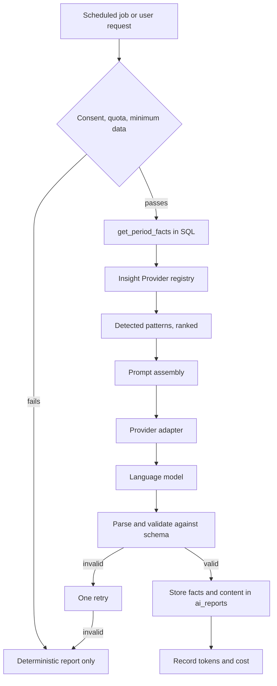

# 29 - AI Architecture and Prompt Contracts

| Field        | Value      |
| ------------ | ---------- |
| Document ID  | DF-DOC-029 |
| Version      | 0.1.0      |
| Status       | Draft      |
| Owner        | Founder    |
| Last updated | 2026-08-04 |

---

## 1. Purpose

How AI insights are produced: the pipeline, the provider abstraction, the fact contract,
the prompt structure and the output schema. Product requirements are in
[15 - PRD AI Insights Engine](../02-product/15-prd-ai-insights-engine.md); this document is
the technical realisation.

## 2. Pipeline



Note where the intelligence lives. Patterns are detected in TypeScript from SQL-computed
facts. The model is the last step and its only job is language. This is ADR-011, and it is
what makes every figure in a report verifiable.

## 3. The fact contract

`get_period_facts(p_start, p_end)` returns the complete, pre-computed input. Nothing else is
ever sent to a model.

```typescript
interface PeriodFacts {
  period: {
    type: "daily" | "weekly" | "monthly";
    start: string;
    end: string;
    days: number;
  };
  totals: {
    recordedMinutes: number;
    momentCount: number;
    daysWithData: number;
    averageMinutesPerDay: number;
    longestMomentMinutes: number;
    averageMomentMinutes: number;
  };
  byParentCategory: Array<{
    id: string;
    name: string;
    isDistraction: boolean;
    minutes: number;
    share: number;
    momentCount: number;
  }>;
  byCategory: Array<{
    id: string;
    name: string;
    parentName: string;
    minutes: number;
    share: number;
    momentCount: number;
  }>;
  byDay: Array<{ date: string; minutes: number; score: number | null }>;
  byHour: Array<{ hour: number; minutes: number; distractedMinutes: number }>;
  comparison: {
    previousPeriodMinutes: number;
    changeByParent: Array<{ name: string; deltaMinutes: number; deltaPercent: number }>;
  };
  goals: Array<{
    name: string;
    targetMinutes: number;
    achievedMinutes: number;
    met: boolean;
  }>;
  quality: { autoClosedCount: number; estimatedMinutes: number };
}
```

| ID         | Requirement                                                                                                                                |
| ---------- | ------------------------------------------------------------------------------------------------------------------------------------------ |
| DF-AIA-001 | Only `PeriodFacts` MUST be sent to a model. No raw Moment row, ever.                                                                       |
| DF-AIA-002 | Moment notes MUST NOT be included, per DF-AI-063.                                                                                          |
| DF-AIA-003 | Category names ARE included, since they are required for the output to be meaningful, and this MUST be stated plainly in the consent text. |
| DF-AIA-004 | Facts MUST be truncated to the top 15 categories if the user has more.                                                                     |

DF-AIA-003 is a deliberate, disclosed trade-off. An insight reading "category 7 rose 40%" is
useless, so names must go. Because a category name can itself be personal information, the
consent screen says so explicitly rather than burying it.

## 4. Insight Providers

```typescript
interface InsightProvider {
  id: string;
  label: string;
  periods: ReadonlyArray<"daily" | "weekly" | "monthly">;
  minimumDays: number;
  detect(facts: PeriodFacts): DetectedPattern[];
}

interface DetectedPattern {
  providerId: string;
  kind: string;
  severity: "info" | "notable" | "important";
  summary: string;
  evidence: Record<string, string | number>;
}
```

Registration is a single array export. Adding a provider touches no existing file, which is
the concrete test of the extensibility claim in charter principle 6.

| ID         | Requirement                                                                          |
| ---------- | ------------------------------------------------------------------------------------ |
| DF-AIA-010 | Providers MUST be pure functions of `PeriodFacts`, with no I/O.                      |
| DF-AIA-011 | A provider MUST return an empty array rather than throwing when it finds nothing.    |
| DF-AIA-012 | A throwing provider MUST be caught, logged and skipped.                              |
| DF-AIA-013 | Every pattern MUST carry evidence, which becomes the citation required by DF-AI-032. |
| DF-AIA-014 | Patterns MUST be ranked by severity and the top 6 passed to the prompt.              |

Being pure functions makes providers trivially unit-testable: construct a `PeriodFacts`
fixture, assert on the patterns. No database, no network, no model.

## 5. Provider adapter

```typescript
interface AIProvider {
  id: string;
  generate(request: GenerationRequest): Promise<GenerationResult>;
}
```

Adapters exist for OpenAI and Anthropic. Selection is by the `AI_PROVIDER` environment
variable, satisfying DF-AI-055 - swapping providers is configuration, not code.

| ID         | Requirement                                                       |
| ---------- | ----------------------------------------------------------------- |
| DF-AIA-020 | All calls MUST be server-side only.                               |
| DF-AIA-021 | Adapters MUST enforce a request timeout of 30 seconds.            |
| DF-AIA-022 | Adapters MUST retry once on a transient failure, with backoff.    |
| DF-AIA-023 | Adapters MUST return token counts for cost recording.             |
| DF-AIA-024 | An unavailable provider MUST degrade to the deterministic report. |

## 6. Prompt structure

Three parts: a system prompt establishing role and constraints, a user prompt carrying facts
and detected patterns as JSON, and a strict output schema.

### 6.1 System prompt

```
You are the analysis writer for DayFlow AI, a personal time tracking product.

You will receive pre-computed statistics and detected patterns about one user's
recorded time. Your only task is to express them clearly.

Rules you must follow:
- Never calculate. Every number you use must appear in the input verbatim.
- Never judge. Describe what happened; do not praise, scold, or moralise.
- Never give medical, psychological or clinical advice.
- Never invent a pattern that is not in the detected patterns list.
- Cite the figures supporting each insight.
- Write in second person, plainly, without productivity jargon.
- If the evidence is weak, say so rather than overstating it.

Recommendations must be specific to this user's data. Generic advice such as
"try time blocking" is not acceptable.
```

The "never calculate" instruction is reinforced by the architecture rather than trusted:
because the model only receives finished figures, there is nothing for it to compute.

### 6.2 Output schema

Validated with Zod before storage. Anything failing validation is discarded, retried once,
then degraded.

```typescript
const ReportSchema = z.object({
  summary: z.string().min(40).max(600),
  insights: z
    .array(
      z.object({
        title: z.string().max(80),
        body: z.string().max(600),
        figures: z.array(z.string()).min(1),
        providerId: z.string(),
      }),
    )
    .min(1)
    .max(6),
  recommendations: z
    .array(
      z.object({
        title: z.string().max(80),
        body: z.string().max(400),
        basedOn: z.string(),
      }),
    )
    .max(3),
});
```

`figures` being non-empty is the schema-level enforcement of DF-AI-032: an insight that
cites nothing cannot be stored.

| ID         | Requirement                                                         |
| ---------- | ------------------------------------------------------------------- |
| DF-AIA-030 | Output MUST be validated before storage.                            |
| DF-AIA-031 | Invalid output MUST trigger exactly one retry, then degrade.        |
| DF-AIA-032 | Every insight MUST cite at least one figure.                        |
| DF-AIA-033 | Every recommendation MUST name the pattern it derives from.         |
| DF-AIA-034 | Structured output mode MUST be used where the provider supports it. |

## 7. Cost control

| ID         | Requirement                                                                   |
| ---------- | ----------------------------------------------------------------------------- |
| DF-AIA-040 | Every call MUST be recorded in `ai_usage` with tokens, model and cost.        |
| DF-AIA-041 | A per-user monthly ceiling MUST be enforced before any call is made.          |
| DF-AIA-042 | A global daily spend cap MUST disable generation automatically when exceeded. |
| DF-AIA-043 | Prompts MUST be capped at 8,000 input tokens.                                 |
| DF-AIA-044 | Reports MUST be stored and never regenerated implicitly.                      |

A typical weekly report runs roughly 1,500 input and 500 output tokens. Because facts are
summaries rather than rows, prompt size is bounded by the number of categories, not by the
number of Moments - a user with three years of history costs the same as one with three
weeks.

## 8. Deterministic fallback

Produced whenever AI is disabled, consent is absent, quota is exhausted, or generation
fails. It contains the same statistics and the same detected patterns, rendered from
templates instead of generated prose.

| ID         | Requirement                                                        |
| ---------- | ------------------------------------------------------------------ |
| DF-AIA-050 | The fallback MUST always be available and MUST cost nothing.       |
| DF-AIA-051 | It MUST be clearly labelled as a summary rather than an AI report. |
| DF-AIA-052 | It MUST contain the same figures the AI report would have used.    |

This is what makes the free tier of
[08 - Business Model and Pricing](../01-business/08-business-model-and-pricing.md) genuinely
complete: a non-paying user still gets every pattern the system detects, just without the
prose.

## 9. Testing

| ID         | Requirement                                                                |
| ---------- | -------------------------------------------------------------------------- |
| DF-AIA-060 | Every provider MUST have unit tests over fixture facts.                    |
| DF-AIA-061 | Schema validation MUST be tested against deliberately malformed output.    |
| DF-AIA-062 | The pipeline MUST be testable with a mock adapter, requiring no network.   |
| DF-AIA-063 | A test MUST assert that no raw Moment data appears in an assembled prompt. |

DF-AIA-063 is a privacy guarantee enforced by a test rather than by discipline, which is the
only way such guarantees survive refactoring.

---

## Change History

| Version | Date       | Author  | Change         |
| ------- | ---------- | ------- | -------------- |
| 0.1.0   | 2026-08-04 | Founder | Initial draft. |
