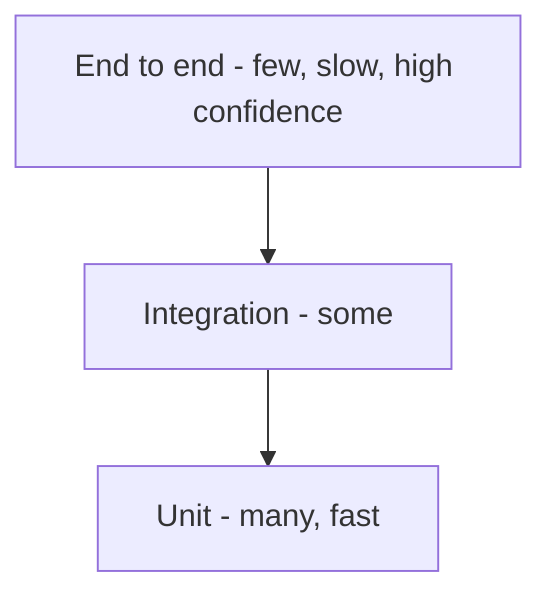

# 31 - Testing Strategy

| Field        | Value      |
| ------------ | ---------- |
| Document ID  | DF-DOC-031 |
| Version      | 0.1.0      |
| Status       | Draft      |
| Owner        | Founder    |
| Last updated | 2026-08-04 |

---

## 1. Purpose

What is tested, at which level, and what is deliberately not tested. Written with a
constraint in mind: this is a solo, part-time project, so the test suite must be small
enough to maintain and targeted enough to be worth maintaining.

## 2. Priorities

Testing effort is spent where a defect would be most damaging, in this order:

1. **Silent data corruption.** A wrong duration or a mis-attributed day is worse than a
   crash, because the user never finds out and their conclusions are wrong.
2. **Rules that must not be bypassable.** The queue limit and validation, which are the
   product's credibility.
3. **The core capture journey.** If recording a Moment breaks, nothing else matters.
4. **Security boundaries.** RLS and cron authentication.
5. Everything else.

## 3. Levels



### 3.1 Unit tests, Vitest

Cover everything in `lib/domain`, which is pure functions by construction and therefore
needs no database, no network and no mocks.

| Area                     | Cases                                                                                          |
| ------------------------ | ---------------------------------------------------------------------------------------------- |
| Queue rules              | Under limit, at limit, over limit after a reduction, updating an existing pending Moment.      |
| Time validation          | End before start, end equal to start, future start within and beyond tolerance, over 24 hours. |
| Midnight splitting       | Within one day, crossing one midnight, crossing two, exactly at midnight, DST transitions.     |
| Duration                 | Whole minutes, sub-minute, overnight, month boundary.                                          |
| Quiet hours              | Inside, outside, window crossing midnight, start equal to end.                                 |
| Streaks                  | Continuous, single break, no-data day, at-most goal with zero minutes, retroactive repair.     |
| Productivity score       | All positive, all negative, mixed, no data, weights all zero.                                  |
| Reminder due calculation | Never reminded, recently reminded, exactly at interval, disabled.                              |
| Insight providers        | Each against fixture facts, including the empty case.                                          |

| ID         | Requirement                                                            |
| ---------- | ---------------------------------------------------------------------- |
| DF-TST-001 | Every function in `lib/domain` MUST have unit tests.                   |
| DF-TST-002 | Every boundary condition in a documented rule MUST have a test.        |
| DF-TST-003 | Tests MUST name the requirement identifier they verify.                |
| DF-TST-004 | Unit tests MUST NOT require a database, a network or a running server. |

DF-TST-003 makes the traceability of
[01 - Documentation Index and Standards](../00-governance/01-documentation-index-and-standards.md)
section 9 real:

```typescript
it("DF-QUE-003: refuses a third pending moment when the limit is 2", () => { ... });
```

The DST cases in midnight splitting deserve particular attention. A day is not always 24
hours long, and code that assumes it is will silently mis-attribute time twice a year.

### 3.2 Integration tests

Run against a local Supabase instance, covering what unit tests cannot: triggers, policies
and constraints.

| Area               | Cases                                                                       |
| ------------------ | --------------------------------------------------------------------------- |
| Queue trigger      | Third pending Moment rejected; updating an existing pending Moment allowed. |
| Constraints        | End before start rejected; duplicate rejected; over 24 hours rejected.      |
| Status transitions | Adding an end time promotes to completed; clearing returns to pending.      |
| System protection  | Renaming or deleting Distracted Time rejected.                              |
| Referential rules  | Deleting a category with Moments rejected.                                  |
| Seeding            | A new user receives exactly six parents and seventeen categories.           |
| RLS                | User A cannot read, update or delete any row of user B, on every table.     |
| Aggregation        | Functions return correct totals including overnight splits.                 |

| ID         | Requirement                                                              |
| ---------- | ------------------------------------------------------------------------ |
| DF-TST-010 | Every trigger MUST have a test proving it rejects what it should.        |
| DF-TST-011 | Every table MUST have an RLS test proving cross-user access fails.       |
| DF-TST-012 | RLS tests MUST use the REST endpoint directly, not the application.      |
| DF-TST-013 | Aggregation tests MUST include an overnight Moment and assert the split. |

DF-TST-012 is the point of these tests. Going through the application would test the
application, when the threat model is a client that bypasses it entirely.

### 3.3 End-to-end tests, Playwright

Deliberately few. They are slow and brittle, so they cover only journeys where a failure
would make the product unusable.

| Journey               | Assertions                                                                      |
| --------------------- | ------------------------------------------------------------------------------- |
| Sign up and first run | Account created, categories seeded, dashboard renders populated.                |
| Complete capture      | Moment saved, appears on the timeline, totals update.                           |
| Pending and closure   | Saved as pending, queue card appears, closing removes it.                       |
| Queue refusal         | Third Moment refused, pending Moments listed, inline close then retry succeeds. |
| Category management   | Create, rename, reassign with warning, archive.                                 |
| Analytics controls    | Range, grouping and distraction toggles all change the rendered output.         |
| Settings              | Changing the queue limit takes effect immediately.                              |
| Responsive            | Every journey passes at 320px and at 1440px.                                    |

| ID         | Requirement                                                                 |
| ---------- | --------------------------------------------------------------------------- |
| DF-TST-020 | End-to-end tests MUST run against a seeded test database, never production. |
| DF-TST-021 | They MUST run on both a desktop and a mobile viewport.                      |
| DF-TST-022 | They MUST include an axe-core accessibility scan per page.                  |
| DF-TST-023 | They MUST be independent and runnable in any order.                         |

## 4. Not tested

Stated explicitly so that the gaps are decisions rather than accidents.

| Not tested                    | Why                                                                                            |
| ----------------------------- | ---------------------------------------------------------------------------------------------- |
| Third-party library internals | Not our code.                                                                                  |
| Exact visual appearance       | Snapshot tests on a changing interface produce noise, not signal.                              |
| AI output quality             | Non-deterministic. The schema is tested; the prose is not.                                     |
| Push delivery end to end      | Depends on browser vendor infrastructure. Send logic is tested; delivery is verified manually. |
| Performance under load        | Not meaningful at the intended scale.                                                          |

## 5. Test data

Fixtures cover a new user with nothing, a light user with a week, a heavy user with a year,
a user with overnight Moments across a DST boundary, and a user with pending Moments at
every escalation state.

| ID         | Requirement                                                              |
| ---------- | ------------------------------------------------------------------------ |
| DF-TST-030 | Fixtures MUST be deterministic, with fixed dates and no randomness.      |
| DF-TST-031 | Time-dependent tests MUST use an injected clock, never the system clock. |
| DF-TST-032 | Fixtures MUST NOT contain real personal data.                            |

DF-TST-031 is not optional for this product: almost every rule in it is a function of the
current time, and a test that reads the system clock will fail at midnight, at a month
boundary, or on a DST changeover - and will do so months after the code was written.

## 6. Coverage

Coverage is a diagnostic, not a target. `lib/domain` should approach complete branch
coverage because it is pure and cheap to test; component coverage is not measured, because
chasing a number there produces tests that assert implementation details.

## 7. Continuous integration

Every pull request runs typecheck, lint, format check, unit tests, integration tests against
a local Supabase, a production build, and end-to-end tests. All must pass to merge.

## 8. Manual verification before release

Automated tests do not cover everything, and this checklist is what catches the rest:

1. Keyboard-only pass through every journey.
2. Screen reader spot check with NVDA and VoiceOver.
3. Push notification received on a real phone with the app closed.
4. **End now** from a notification with the app closed.
5. Two devices signed in simultaneously; a change on one appears on the other.
6. Airplane mode: cached data readable, write fails visibly, entered data preserved.
7. 200% zoom and 320px width.
8. Lighthouse against the performance budgets.

Items 3, 4 and 5 cannot be meaningfully automated and are precisely the features that
distinguish the product, so they are verified by hand every release.

---

## Change History

| Version | Date       | Author  | Change         |
| ------- | ---------- | ------- | -------------- |
| 0.1.0   | 2026-08-04 | Founder | Initial draft. |
