# 33 - CI/CD and Deployment Runbook

| Field        | Value      |
| ------------ | ---------- |
| Document ID  | DF-DOC-033 |
| Version      | 0.2.0      |
| Status       | Draft      |
| Owner        | Founder    |
| Last updated | 2026-08-04 |

---

## 1. Purpose

How code reaches production, what gates it passes, how a first deployment is performed from
nothing, and how to get back when something goes wrong. Written to be followed at 2am by
somebody who has forgotten the details - which, on a solo project, will be the author.

## 2. Pipeline

```mermaid
flowchart LR
  Branch["Feature branch"] --> PR["Pull request"]
  PR --> CI["CI: typecheck, lint, unit, integration, build"]
  CI --> Preview["Vercel preview deployment"]
  Preview --> E2E["Playwright against preview"]
  E2E --> Review["Review"]
  Review --> Merge["Merge to main"]
  Merge --> Mig["Apply migrations to production"]
  Mig --> Deploy["Vercel production deployment"]
  Deploy --> Smoke["Smoke checklist"]
```



**Migrations are applied before the code that needs them.** This ordering is the whole
reason expand-and-contract is mandatory: for the brief window between the two steps, the
previous application version is running against the new schema, and it must keep working.

## 3. Continuous integration

Implemented in `.github/workflows/ci.yml`. Runs on every pull request, on every push to
`main`, and on demand.

| Job          | Step                         | Command                                         | Status                    |
| ------------ | ---------------------------- | ----------------------------------------------- | ------------------------- |
| `verify`     | Format                       | `npm run format:check`                          | implemented               |
| `verify`     | Lint                         | `npm run lint`                                  | implemented               |
| `verify`     | Unit tests                   | `npm run test`                                  | implemented               |
| `verify`     | Build                        | `npm run build`                                 | implemented               |
| `verify`     | Typecheck                    | `npm run typecheck`                             | implemented               |
| `verify`     | Bundle size budget           | `npm run budget`                                | implemented, see 3.2      |
| `e2e`        | Public end-to-end suite      | `npx playwright test e2e/public-routes.spec.ts` | implemented               |
| `migrations` | Migrations from empty, twice | `psql -f` over `supabase/migrations/*.sql`      | implemented               |
| —            | Authenticated end-to-end     | `npx playwright test e2e/authenticated.spec.ts` | manual, needs credentials |

### 3.1 Why the jobs are shaped this way

**Build runs before typecheck, not after.** `typedRoutes` generates `.next/types/routes.d.ts`
during the build, and `tsconfig.json` includes it. On a fresh clone `tsc --noEmit` has nothing
to resolve typed `href` values against. The build also runs its own type check, so the
separate typecheck step exists only to cover what the build does not compile: tests, scripts
and config files.

**CI runs with placeholder credentials only.** `NEXT_PUBLIC_SUPABASE_URL` and friends point at
a project that does not exist. Everything that must pass on every commit is therefore
provable without infrastructure, and CI stays runnable on a fork and on a first clone.

**The authenticated end-to-end suite skips itself rather than failing.** It needs `E2E_EMAIL`
and `E2E_PASSWORD` for a real throwaway account. A suite that is red by default on every
developer machine trains people to ignore red, which costs more than the coverage is worth.
See the header comment in `e2e/authenticated.spec.ts`.

**Migrations are applied from empty, then applied again.** A migration that has only ever run
against an already-migrated database is untested. The first pass proves a new environment or a
restored backup can be built from the suite; the second proves the suite is idempotent. The job
stubs the objects Supabase supplies - the `auth` schema, `auth.uid()`, the `anon`,
`authenticated` and `service_role` roles, the `supabase_realtime` publication - and skips
`0011_scheduled_jobs.sql`, which needs `pg_cron` and Vault. That skip is verified manually in
section 7 instead.

| ID        | Requirement                                                                      |
| --------- | -------------------------------------------------------------------------------- |
| DF-CD-001 | Every job MUST pass before merge.                                                |
| DF-CD-002 | CI MUST NOT have access to production credentials.                               |
| DF-CD-003 | CI MUST fail if a migration file that already exists upstream has been modified. |
| DF-CD-004 | CI MUST fail on a bundle size exceeding the budget in DF-A11Y-060 onwards.       |

DF-CD-003 catches the single most damaging mistake possible in this repository. An edited
migration applies to a fresh database but not to one that already ran the original, so
development and production silently diverge with no error anywhere. It is **not yet enforced
by the workflow** - it currently relies on review. Enforcing it needs a step that diffs
`supabase/migrations/` against the merge base and fails on any modification to a file that
already exists there.

### 3.2 The bundle size budget

DF-CD-004 is enforced by the `Bundle size budget` step in `verify`, which runs
`scripts/check-bundle-budget.mjs` against the route table the build step captures to
`build-output.txt`. The build is piped through `tee` with `pipefail` set, so the log exists
without paying for a second build, and a build that fails still fails the step rather than
reporting `tee`'s exit code.

Three routes were already over the 200 kB budget when the step was added: `/dashboard`,
`/calendar/[date]` and `/goals`, between 202 and 204 kB, each because it carries the
Supabase browser client in its First Load JS. They are named in the `ALLOWANCES` list in
the script, with the size each had at that moment as its ceiling, so they may be fixed but
may not grow. Every other route fails the build on crossing 200 kB.

When one of the three does come in under budget, the check fails and asks for its entry to
be deleted. That is deliberate: an exemption nobody is compelled to revisit becomes the
budget. [ADR-015](../00-governance/04-decision-log.md) records the reasoning, including why
this is not a warning-only step.

The budget figure belongs to section 9 of
[22 - Accessibility and Responsive Standards](../03-ux/22-accessibility-and-responsive-standards.md).
Changing it requires a decision log entry, not an edit to the script.

## 4. First deployment, from nothing

### 4.1 Supabase

The order below matters. `0011_scheduled_jobs.sql` reads the app URL and the cron secret from
Vault at apply time, so the secrets have to exist before the migrations run - not after.

1. Create the production project. Record the region and the database password somewhere
   durable.
2. Copy the project URL, anon key and service role key.
3. Enable the `pg_cron` and `pg_net` extensions from Database → Extensions.
4. Store the Vault secrets `dayflow_app_url` and `dayflow_cron_secret`. Those exact names
   are what `public.invoke_cron_endpoint` in `0011_scheduled_jobs.sql` looks up, and a
   secret stored under any other name reads as absent. `dayflow_app_url` takes the deployed
   origin with no trailing slash, because the function appends a path to it.
   `dayflow_cron_secret` must match the `CRON_SECRET` you set in Vercel, or every scheduled
   job will get a 401 from your own API.
5. Link the CLI: `supabase link --project-ref <ref>`.
6. Apply the whole migration suite: `supabase db push`. This includes `0012_realtime.sql`,
   which adds the synced tables to the `supabase_realtime` publication, and
   `0014_scheduled_report_support.sql`, which grants the service role the one function it needs
   to compute a report on a user's behalf.
7. Verify every table in `public` reports `rowsecurity = true`.
8. Confirm the two jobs registered: `select jobname, schedule from cron.job;` should list
   `dayflow-reminders` and `dayflow-auto-close`.
9. Configure Auth: site URL, redirect URLs (including `/auth/callback`), and email templates.
   The password reset template must point at `/auth/callback?next=/update-password`.

### 4.2 Vercel

1. Import the repository and select Next.js.
2. Add every variable from
   [32 - Environment and Configuration](32-environment-and-configuration.md), marking
   secrets as sensitive.
3. Deploy.
4. Attach the custom domain and confirm HTTPS.
5. Set `NEXT_PUBLIC_APP_URL` to the final domain and redeploy - auth redirects and push deep
   links both depend on it being exactly right.

### 4.3 Verification

1. Sign up with a fresh address; confirm the 6 seeded parent categories and 17 categories
   exist, and that Distracted Time cannot be renamed or deleted.
2. Create a completed Moment; confirm it appears on the timeline.
3. Create a pending Moment; confirm the queue card and its live timer.
4. Attempt a third pending Moment; confirm refusal, not a dismissible warning.
5. Grant notification permission in Settings, then invoke `/api/cron/reminders` with the
   secret; confirm a notification arrives and that tapping "Close it now" lands on
   `/dashboard?close=<id>` with the close dialog already open.
6. Confirm `/api/cron/reminders` returns 401 without the secret and 200 with it.
7. Generate a report from Insights with AI off; confirm it is a full report badged "No AI",
   not a placeholder.
8. Sign in on a second device; confirm a change propagates without a refresh.
9. Request a password reset; confirm the emailed link lands on `/update-password` and that
   reusing the same link afterwards shows the expired-link message rather than a broken form.
10. Run Lighthouse against the budgets.

## 5. Routine release

```bash
# 1. Verify main is green
git checkout main && git pull

# 2. Apply migrations first
supabase db push --linked

# 3. Tag
git tag v0.2.0 && git push --tags

# 4. Vercel deploys automatically from main

# 5. Smoke test
```

### Smoke checklist

Six checks, in this order, taking about two minutes:

1. The application loads and the dashboard renders.
2. A Moment can be created and appears immediately.
3. The pending queue behaves, including the refusal.
4. Analytics render for the current week.
5. Settings load and a change persists.
6. No errors in the Vercel function logs.

## 6. Rollback

**Application code.** Promote the previous deployment in Vercel. Immediate, and safe
provided the schema still satisfies it - which expand-and-contract guarantees.

**Database.** Does not roll back. A faulty migration is corrected by a new forward
migration. This asymmetry is why the ordering in section 2 exists.

| Situation                       | Response                                                                                           |
| ------------------------------- | -------------------------------------------------------------------------------------------------- |
| Interface defect                | Promote previous deployment.                                                                       |
| Migration applied but incorrect | Write a corrective migration; do not attempt to reverse it.                                        |
| Data corrupted by a migration   | Restore from a point-in-time backup per [37](../06-operations/37-backup-and-disaster-recovery.md). |
| Secret leaked                   | Rotate immediately, redeploy, record the incident.                                                 |

## 7. Cron verification after deployment

Reminders are the easiest thing to break without noticing, because nothing errors - they
simply stop.

```sql
-- jobs are registered
select jobname, schedule, active from cron.job;

-- recent runs succeeded
select jobid, status, return_message, start_time
from cron.job_run_details
order by start_time desc
limit 20;
```

The three scheduled endpoints and who invokes each:

| Endpoint                 | Schedule     | Invoked by  | Why there                                                        |
| ------------------------ | ------------ | ----------- | ---------------------------------------------------------------- |
| `/api/cron/reminders`    | every 10 min | `pg_cron`   | Vercel Hobby allows one cron run per day, which is useless here. |
| `/api/cron/auto-close`   | every 15 min | `pg_cron`   | Same.                                                            |
| `/api/cron/daily-report` | once daily   | Vercel Cron | Daily cadence fits the Hobby limit; see `vercel.json`.           |

`/api/cron/daily-report` serves every timezone from a single run. It computes each user's own
local yesterday and only generates a weekly report on the day after that user's own week
boundary, so nobody receives a summary of a day still in progress. Verify it by invoking it
with the secret and checking `ai_reports` gained rows only for users whose period had actually
finished.

| ID        | Requirement                                                                                            |
| --------- | ------------------------------------------------------------------------------------------------------ |
| DF-CD-010 | Cron registration MUST be verified after every deployment that touches it.                             |
| DF-CD-011 | A missed run MUST raise an alert, per [36](../06-operations/36-observability-and-incident-runbook.md). |
| DF-CD-012 | `CRON_SECRET` MUST match in Vercel and in Supabase Vault after any rotation.                           |
| DF-CD-013 | Every cron endpoint MUST return 401 without the bearer secret. Covered by `e2e/public-routes.spec.ts`. |

## 8. Preview deployments

Every pull request gets a preview URL pointing at the development database, with
`AI_ENABLED=false` unless the change is specifically about AI.

| ID        | Requirement                                                                 |
| --------- | --------------------------------------------------------------------------- |
| DF-CD-020 | Previews MUST NOT use production credentials, ever.                         |
| DF-CD-021 | Previews MUST be excluded from search engine indexing.                      |
| DF-CD-022 | Previews MUST NOT send real push notifications to production subscriptions. |

## 9. Release notes

Every tagged release gets notes covering what changed, anything the user must do, any
migration applied, and any known issue. Written for the user, not from the commit log.

---

## Change History

| Version | Date       | Author  | Change                                                                                          |
| ------- | ---------- | ------- | ----------------------------------------------------------------------------------------------- |
| 0.1.0   | 2026-08-04 | Founder | Initial draft.                                                                                  |
| 0.1.1   | 2026-08-04 | Founder | Corrected the Vault secret names in section 4.1 to `dayflow_app_url` and `dayflow_cron_secret`. |
| 0.2.0   | 2026-08-04 | Founder | Recorded the bundle size budget step as implemented and added section 3.2 describing it. Per ADR-015. |
