# 33 - CI/CD and Deployment Runbook

| Field        | Value      |
| ------------ | ---------- |
| Document ID  | DF-DOC-033 |
| Version      | 1.1.0      |
| Status       | Draft      |
| Owner        | Founder    |
| Last updated | 2026-08-06 |

---

## 1. Purpose

How code reaches production, what gates it passes, how a first deployment is performed from
nothing, and how to get back when something goes wrong. Written to be followed at 2am by
somebody who has forgotten the details - which, on a solo project, will be the author.

## 2. Pipeline

```mermaid
flowchart LR
  Branch["Feature branch"] --> PR["Pull request"]
  PR --> CI["CI: typecheck, lint, unit, integration, build"]
  CI --> Preview["Vercel preview deployment"]
  Preview --> E2E["Playwright against preview"]
  E2E --> Review["Review"]
  Review --> Merge["Merge to main"]
  Merge --> Mig["Apply migrations to production"]
  Mig --> Deploy["Vercel production deployment"]
  Deploy --> Smoke["Smoke checklist"]
```



**Migrations are applied before the code that needs them.** This ordering is the whole
reason expand-and-contract is mandatory: for the brief window between the two steps, the
previous application version is running against the new schema, and it must keep working.

## 3. Continuous integration

Defined in `.github/workflows/ci.yml`. The triggers declared there are every pull request,
every push to `main`, and manual dispatch.

> **Status: first executed 6 August 2026, on commit `f5755f5`. Two jobs of four passed.**
>
> `verify` passed. `migrations` passed. `audit` failed. `e2e` failed, with 4 of its 38 tests
> red. Detail is in 3.3 and 3.4; the Status column below now records observed results rather
> than the authored-but-unrun placeholder it carried until this version.
>
> The previous note said this workflow had never executed, and warned that the first run
> should be expected to fail on things nobody had seen yet, because every job runs on a clean
> checkout on a Linux runner while the only execution evidence was local runs on one
> developer's Windows machine. That warning was correct twice over, and both failures were of
> exactly that kind: an advisory published by a third party, and browser behaviour that no
> unit test reaches.
>
> The habit that note was defending is still the one that matters here. A row below reading
> "passed" means a specific run of that job was observed to succeed, and nothing more. It is
> not a claim about the current working tree, and where a fix has been made locally since the
> run but not yet been through CI, the row says so.

| Job          | Step                         | Command                                         | Status                       |
| ------------ | ---------------------------- | ----------------------------------------------- | ---------------------------- |
| `verify`     | Format                       | `npm run format:check`                          | passed                       |
| `verify`     | Lint                         | `npm run lint`                                  | passed; 3 known `no-console` |
| `verify`     | Unit tests                   | `npm run test`                                  | passed                       |
| `verify`     | Build                        | `npm run build`                                 | passed                       |
| `verify`     | Typecheck                    | `npm run typecheck`                             | passed                       |
| `verify`     | Bundle size budget           | `npm run budget`                                | passed; 3.2                  |
| `audit`      | Dependency audit             | `npm audit --audit-level=high`                  | **failed**; 3.3              |
| `e2e`        | Public end-to-end suite      | `npx playwright test e2e/public-routes.spec.ts` | **failed**; 4 of 38, 3.4     |
| `migrations` | Migrations from empty, twice | `psql -f` over `supabase/migrations/*.sql`      | passed; 3.5                  |
| —            | Authenticated end-to-end     | `npx playwright test e2e/authenticated.spec.ts` | manual, needs credentials    |

The Status column records whether the step passed, which is what the run reports. The figures
those steps produce - 332 unit tests across 14 files, 24 routes built, 21 of 24 within the
bundle budget - are the local numbers, and are quoted as such wherever they appear below.

The three `no-console` warnings are in `scripts/build-all-migrations.mjs` and
`scripts/check-bundle-budget.mjs`, which print their results for a human to read. They are
warnings, not errors, and the lint step passes with them.

### 3.1 Why the jobs are shaped this way

**Build runs before typecheck, not after.** `typedRoutes` generates `.next/types/routes.d.ts`
during the build, and `tsconfig.json` includes it. On a fresh clone `tsc --noEmit` has nothing
to resolve typed `href` values against. The build also runs its own type check, so the
separate typecheck step exists only to cover what the build does not compile: tests, scripts
and config files.

**CI runs with placeholder credentials only.** `NEXT_PUBLIC_SUPABASE_URL` and friends point at
a project that does not exist. Everything that must pass on every commit is therefore
provable without infrastructure, and CI stays runnable on a fork and on a first clone.

**The dependency audit is its own job, with no `needs`.** DF-SEC-026. An advisory is
published by a third party at a moment of their choosing, so as a step inside `verify` it
would turn an unrelated pull request red for a reason its author cannot fix - which trains
everyone to ignore the result. Isolated, the failure stays legible and blocks only itself. It
runs at `--audit-level=high` and does not run `npm ci` first, because `npm audit` resolves the
committed lockfile against the registry and does not need the tree on disk. See the header
comment on the job in `.github/workflows/ci.yml`, and 3.3 for what it found the first time it
ran.

**The authenticated end-to-end suite skips itself rather than failing.** It needs `E2E_EMAIL`
and `E2E_PASSWORD` for a real throwaway account. A suite that is red by default on every
developer machine trains people to ignore red, which costs more than the coverage is worth.
See the header comment in `e2e/authenticated.spec.ts`.

**Migrations are applied from empty, then applied again.** A migration that has only ever run
against an already-migrated database is untested. The first pass proves a new environment or a
restored backup can be built from the suite; the second proves the suite is idempotent. The job
stubs the objects Supabase supplies - the `auth` schema, `auth.uid()`, the `anon`,
`authenticated` and `service_role` roles, the `supabase_realtime` publication - and skips
`0011_scheduled_jobs.sql`, which needs `pg_cron` and Vault. That skip is verified manually in
section 7 instead.

| ID        | Requirement                                                                      |
| --------- | -------------------------------------------------------------------------------- |
| DF-CD-001 | Every job MUST pass before merge.                                                |
| DF-CD-002 | CI MUST NOT have access to production credentials.                               |
| DF-CD-003 | CI MUST fail if a migration file that already exists upstream has been modified. |
| DF-CD-004 | CI MUST fail on a bundle size exceeding the budget in DF-A11Y-060 onwards.       |

**DF-CD-001 is not currently satisfied.** Two of the four jobs were red on the only run this
workflow has had, so on the state of `f5755f5` nothing should merge. That is the requirement
doing its job, and it is recorded here rather than quietly deferred.

DF-CD-003 catches the single most damaging mistake possible in this repository. An edited
migration applies to a fresh database but not to one that already ran the original, so
development and production silently diverge with no error anywhere. It is **not yet enforced
by the workflow** - it currently relies on review. Enforcing it needs a step that diffs
`supabase/migrations/` against the merge base and fails on any modification to a file that
already exists there.

### 3.2 The bundle size budget

DF-CD-004 is enforced by the `Bundle size budget` step in `verify`, which ran and passed for
the first time on 6 August 2026. Locally it reports 21 of 24 routes within the 200 kB budget,
with the other three inside their named allowances. It runs
`scripts/check-bundle-budget.mjs` against the route table the build step captures to
`build-output.txt`. The build is piped through `tee` with `pipefail` set, so the log exists
without paying for a second build, and a build that fails still fails the step rather than
reporting `tee`'s exit code.

Three routes were already over the 200 kB budget when the step was added: `/dashboard` at
204 kB, `/calendar/[date]` at 203 kB and `/goals` at 202 kB, each because it carries the
Supabase browser client in its First Load JS. They are named in the `ALLOWANCES` list in the
script, with the size each had at that moment as its ceiling, so they may be fixed but may
not grow. Every other route fails the build on crossing 200 kB, and `/insights`,
`/categories` and `/settings` all sit at exactly 200 kB with no headroom at all.

A route that goes over budget through its own feature work is **not** added to that list. It
is fixed by deferring what it just acquired, the way the auth screens defer the Supabase
client and `src/features/analytics` defers Recharts. `/settings` was the example: it reached
202 kB while the export and account-deletion controls were being added and the step failed on
it locally. It has since come back to 200 kB and the step passed in CI. That sequence - gate
red, imports deferred, gate green - is the gate working, not a fault in the gate.

When one of the three named routes does come in under budget, the check also fails, asking
for its entry to be deleted. That is deliberate: an exemption nobody is compelled to revisit
becomes the budget. [ADR-015](../00-governance/04-decision-log.md) records the reasoning,
including why this is not a warning-only step.

The budget figure belongs to section 9 of
[22 - Accessibility and Responsive Standards](../03-ux/22-accessibility-and-responsive-standards.md).
Changing it requires a decision log entry, not an edit to the script.

### 3.3 The first dependency audit failure

`npm audit --audit-level=high` exited 1 on commit `f5755f5`, reporting three high-severity
entries. All three trace to one direct dependency, `next`, and neither vulnerable package is
written by this project or chosen by it.

| Package   | Severity | Path                                                          | Kind                            | Reachable in production                      |
| --------- | -------- | ------------------------------------------------------------- | ------------------------------- | -------------------------------------------- |
| `postcss` | high     | `next` → `postcss` (`node_modules/next/node_modules/postcss`) | transitive, pinned by `next`    | no - build-time CSS pipeline only            |
| `sharp`   | high     | `next` → `sharp` (`node_modules/sharp`)                       | transitive, optional dependency | only via `/_next/image`, which nothing calls |
| `next`    | high     | direct                                                        | direct                          | reported only because it pulls the other two |

**`postcss`.** Four advisories, of which
[GHSA-6g55-p6wh-862q](https://github.com/advisories/GHSA-6g55-p6wh-862q) and
[GHSA-r28c-9q8g-f849](https://github.com/advisories/GHSA-r28c-9q8g-f849) are rated high; both
are arbitrary `.map` file disclosure through an attacker-controlled `sourceMappingURL` comment
in CSS that PostCSS is asked to parse. The threat model is a service that parses untrusted
CSS. Nothing here does: PostCSS runs once, at build time, over Tailwind's own stylesheet and
this repository's `globals.css`, on a runner, and emits no code into any bundle. `next`
15.5.22 depends on `postcss` at an exact pin of `8.4.31`, which is why it appears nested under
`node_modules/next` rather than deduplicated to the root.

**`sharp`.** One advisory,
[GHSA-f88m-g3jw-g9cj](https://github.com/advisories/GHSA-f88m-g3jw-g9cj), covering four libvips
CVEs inherited by every `sharp` below 0.35.0. This one is a production dependency in the sense
that matters - `sharp` is what Next's image optimizer shells out to at request time, so it
processes bytes that arrive over the network - but this application contains no `next/image`
usage at all, so `/_next/image` is never linked and never invoked. That reduces exposure
substantially; it does not make the finding cosmetic, and it is the one of the three that
would have been worth an out-of-band fix.

**The offered fix was a major upgrade to `next@16.3.0` and was not taken.** `npm audit fix
--force` would have moved this project from Next 15.5 to Next 16 in a commit whose stated
purpose was a security patch, which is not a trade anyone should make silently. Both packages
have patched releases inside their own ranges, so the minimal fix is to pull those forward
without touching `next`:

```json
"overrides": {
  "postcss": "^8.5.26",
  "sharp": "^0.35.3"
}
```

`postcss` 8.5.26 is a minor over the 8.4.31 that `next` pins, and the override is required
precisely because that pin is exact - nothing else can lift it. `sharp` 0.35.3 is a major over
the `^0.34.3` that `next` declares, so it needs justifying: every breaking change in `sharp`
0.35 is in image-processing API surface that Next does not touch. Next calls the constructor
with `limitInputPixels` and `sequentialRead`, then `timeout`, `rotate`, `resize`, one of
`avif`/`webp`/`png`/`jpeg`, and `toBuffer`. It uses none of the removed `failOnError`
constructor property, the removed `sharpen` properties, the removed `paletteBitDepth`
metadata, or the renamed `format.jp2k`. `sharp` 0.35 also raises its Node floor to >=20.9.0,
which is the floor this project already declares.

After the overrides, `npm audit --audit-level=high` exits 0 and reports no vulnerabilities.
**That has been verified locally only.** No CI run has been observed since the change, and the
row in the table above still records the failure that was actually seen. The bundle is
unaffected: `postcss` emits no JavaScript and `sharp` is required at runtime by the server
rather than bundled, and a full build before and after the change produced an identical route
table down to the shared chunk hashes.

If a future advisory has no fix inside the current major - the realistic case being one
against `next` itself - the response is **not** to lower `--audit-level`, add `--omit=dev`, or
delete the job. Any of those makes the gate stop reporting while looking like it still works.
The response is a dated, named exception recorded here and reviewed on the monthly cadence in
GO-LIVE.md 4.2, stating the advisory ID, the package and path, why the fix cannot be taken
yet, what compensates for it in the meantime, and the date the decision is revisited. An
exception with no revisit date is a silenced check with extra steps.

### 3.4 The first end-to-end failure

`e2e` failed with 4 of its 38 tests red. The job runs only `e2e/public-routes.spec.ts`, which
needs no database, so these are assertions about markup and behaviour a real browser produced
on a Linux runner - the class of thing no unit test in the `verify` job reaches, and the
reason the job exists.

At the time of writing the failures are being worked on separately and this document makes no
claim about their cause or their fix. The row stays red until a run is observed green.

### 3.5 What the migrations job actually proved

`migrations` passing is the most valuable single result in the first run, and the easiest to
undervalue because it is the job nobody was worried about.

It applied all fifteen migrations, `0001` through `0015`, in order, to an empty PostgreSQL 17
instance, and then applied every one of them a second time to prove idempotency. Nothing local
exercises that. A developer machine and the Supabase development project both hold databases
that were migrated incrementally over weeks, so they only ever prove that the newest migration
applies to the state the previous ones happened to leave. The from-empty path is what a new
environment, a restored backup and a disaster-recovery rehearsal all take, and until this run
it had never been executed anywhere.

The caveats stand: the job stubs what Supabase supplies rather than reimplementing it, and
skips `0011_scheduled_jobs.sql`, which needs `pg_cron` and Vault. What passed is the SQL, not
the platform.

### 3.6 Runner and action versions

Every job in the first run emitted the same warning: `actions/checkout@v4`,
`actions/setup-node@v4` and `actions/upload-artifact@v4` target Node.js 20, which the runner
now forces onto Node.js 24. All three are pinned to `@v7` as of this version - the current
major of each - which is what removes the warning rather than deferring it.

`actions/checkout` v7 adds an `allow-unsafe-pr-checkout` input, defaulting to false, which
blocks checking out fork pull request code under `pull_request_target` and `workflow_run`.
This workflow triggers on `pull_request`, so it is unaffected. `actions/setup-node` v5
introduced automatic caching driven by the `packageManager` field in `package.json` and v6
narrowed that to npm; this workflow has always set `cache: npm` explicitly, so there is
nothing for the detection to decide. `actions/upload-artifact` v7 keeps every input in use
here - `name`, `path`, `retention-days`, `if-no-files-found` - and adds `archive`, which
defaults to true and preserves existing behaviour. The immutability change that made
same-named artifacts fail belongs to v4 and was already absorbed; the two uploads in this
workflow carry distinct names in distinct jobs and both are conditional on `failure()`, so
`overwrite` can stay at its default of false.

The pinned `node-version` moved from 20 to 24 in all three jobs that call `setup-node`. Node
20 reached end of life in April 2026, and pinning it meant this project's own code ran on an
unsupported runtime on a runner that was already executing actions on Node 24. Node 24 is also
what the local toolchain builds and tests against, so CI and the developer machine now agree.
The `engines` floor in `package.json` stays at `>=20.9.0`: it states the minimum this code is
known to work on, which is a different question from what CI should exercise.

**None of the changes in this section have been verified by execution.** A workflow file can
only be proved by a run, and running it requires a push. They were checked by reading the
published `action.yml` for each version to confirm every input in use still exists, and by
parsing the workflow to confirm it is well-formed YAML with the intended job and step
structure. That is not the same as a green run.

## 4. First deployment, from nothing

### 4.1 Supabase

The order below matters, but not for the reason it first appears to.
`0011_scheduled_jobs.sql` does not read Vault when it is applied. It _defines_
`public.invoke_cron_endpoint`, and that function reads the app URL and the cron secret from
Vault each time it is _called_ - see the two `select ... from vault.decrypted_secrets`
statements in the function body, and the file's own header, which says the values are "read
at run time rather than embedded here". Applying 0011 against an empty Vault therefore
succeeds; it does not fail, and it does not need the secrets to exist yet.

What 0011 does do immediately is register the two `pg_cron` schedules, so the function begins
being called within ten minutes of the migration landing. Until the secrets exist, every one
of those calls raises a warning and returns without dispatching anything - reminders and
auto-close silently do nothing. Storing the secrets first is what buys you the absence of
that dead window. It is not a prerequisite for the migration to apply.

1. Create the production project. Record the region and the database password somewhere
   durable.
2. Copy the project URL, anon key and service role key.
3. Enable the `pg_cron` and `pg_net` extensions from Database → Extensions.
4. Store the Vault secrets `dayflow_app_url` and `dayflow_cron_secret`. Those exact names
   are what `public.invoke_cron_endpoint` in `0011_scheduled_jobs.sql` looks up, and a
   secret stored under any other name reads as absent. `dayflow_app_url` takes the deployed
   origin with no trailing slash, because the function appends a path to it.
   `dayflow_cron_secret` must match the `CRON_SECRET` you set in Vercel, or every scheduled
   job will get a 401 from your own API.
5. Link the CLI: `supabase link --project-ref <ref>`.
6. Apply the whole migration suite - fifteen files, `0001` through `0015`: `supabase db push`.
   This includes `0012_realtime.sql`, which adds the synced tables to the
   `supabase_realtime` publication; `0014_scheduled_report_support.sql`, which grants the
   service role the one function it needs to compute a report on a user's behalf; and
   `0015_account_deletion.sql`, which adds `public.delete_account()` and narrows the system
   category-group guard from `0008` so that it does not block the cascade from `auth.users`.
   Without `0015` applied, account deletion cannot succeed at all.
7. Verify every table in `public` reports `rowsecurity = true`.
8. Confirm the two jobs registered: `select jobname, schedule from cron.job;` should list
   `dayflow-reminders` and `dayflow-auto-close`.
9. Configure Auth: site URL, redirect URLs (including `/auth/callback`), and email templates.
   The password reset template must point at `/auth/callback?next=/update-password`.

### 4.2 Vercel

1. Import the repository and select Next.js.
2. Add every variable from
   [32 - Environment and Configuration](32-environment-and-configuration.md), marking
   secrets as sensitive.
3. Deploy.
4. Attach the custom domain and confirm HTTPS.
5. Set `NEXT_PUBLIC_APP_URL` to the final domain and redeploy - auth redirects and push deep
   links both depend on it being exactly right.

### 4.3 Verification

1. Sign up with a fresh address; confirm the 6 seeded parent categories and 17 categories
   exist, and that Distracted Time cannot be renamed or deleted.
2. Create a completed Moment; confirm it appears on the timeline.
3. Create a pending Moment; confirm the queue card and its live timer.
4. Attempt a third pending Moment; confirm refusal, not a dismissible warning.
5. Grant notification permission in Settings, then invoke `/api/cron/reminders` with the
   secret; confirm a notification arrives and that tapping "Close it now" lands on
   `/dashboard?close=<id>` with the close dialog already open.
6. Confirm `/api/cron/reminders` returns 401 without the secret and 200 with it.
7. Generate a report from Insights with AI off; confirm it is a full report badged "No AI",
   not a placeholder.
8. Sign in on a second device; confirm a change propagates without a refresh.
9. Request a password reset; confirm the emailed link lands on `/update-password` and that
   reusing the same link afterwards shows the expired-link message rather than a broken form.
10. Run Lighthouse against the budgets.

## 5. Routine release

```bash
# 1. Verify main is green
git checkout main && git pull

# 2. Apply migrations first
supabase db push --linked

# 3. Tag
git tag v0.2.0 && git push --tags

# 4. Vercel deploys automatically from main

# 5. Smoke test
```

### Smoke checklist

Six checks, in this order, taking about two minutes:

1. The application loads and the dashboard renders.
2. A Moment can be created and appears immediately.
3. The pending queue behaves, including the refusal.
4. Analytics render for the current week.
5. Settings load and a change persists.
6. No errors in the Vercel function logs.

## 6. Rollback

**Application code.** Promote the previous deployment in Vercel. Immediate, and safe
provided the schema still satisfies it - which expand-and-contract guarantees.

**Database.** Does not roll back. A faulty migration is corrected by a new forward
migration. This asymmetry is why the ordering in section 2 exists.

| Situation                       | Response                                                                                           |
| ------------------------------- | -------------------------------------------------------------------------------------------------- |
| Interface defect                | Promote previous deployment.                                                                       |
| Migration applied but incorrect | Write a corrective migration; do not attempt to reverse it.                                        |
| Data corrupted by a migration   | Restore from a point-in-time backup per [37](../06-operations/37-backup-and-disaster-recovery.md). |
| Secret leaked                   | Rotate immediately, redeploy, record the incident.                                                 |

## 7. Cron verification after deployment

Reminders are the easiest thing to break without noticing, because nothing errors - they
simply stop.

```sql
-- jobs are registered
select jobname, schedule, active from cron.job;

-- recent runs succeeded
select jobid, status, return_message, start_time
from cron.job_run_details
order by start_time desc
limit 20;
```

The three scheduled endpoints and who invokes each:

| Endpoint                 | Schedule     | Invoked by  | Why there                                                        |
| ------------------------ | ------------ | ----------- | ---------------------------------------------------------------- |
| `/api/cron/reminders`    | every 10 min | `pg_cron`   | Vercel Hobby allows one cron run per day, which is useless here. |
| `/api/cron/auto-close`   | every 15 min | `pg_cron`   | Same.                                                            |
| `/api/cron/daily-report` | once daily   | Vercel Cron | Daily cadence fits the Hobby limit; see `vercel.json`.           |

`/api/cron/daily-report` serves every timezone from a single run. It computes each user's own
local yesterday and only generates a weekly report on the day after that user's own week
boundary, so nobody receives a summary of a day still in progress. Verify it by invoking it
with the secret and checking `ai_reports` gained rows only for users whose period had actually
finished.

| ID        | Requirement                                                                                            |
| --------- | ------------------------------------------------------------------------------------------------------ |
| DF-CD-010 | Cron registration MUST be verified after every deployment that touches it.                             |
| DF-CD-011 | A missed run MUST raise an alert, per [36](../06-operations/36-observability-and-incident-runbook.md). |
| DF-CD-012 | `CRON_SECRET` MUST match in Vercel and in Supabase Vault after any rotation.                           |
| DF-CD-013 | Every cron endpoint MUST return 401 without the bearer secret. Covered by `e2e/public-routes.spec.ts`. |

## 8. Preview deployments

Every pull request gets a preview URL pointing at the development database, with
`AI_ENABLED=false` unless the change is specifically about AI.

| ID        | Requirement                                                                 |
| --------- | --------------------------------------------------------------------------- |
| DF-CD-020 | Previews MUST NOT use production credentials, ever.                         |
| DF-CD-021 | Previews MUST be excluded from search engine indexing.                      |
| DF-CD-022 | Previews MUST NOT send real push notifications to production subscriptions. |

## 9. Release notes

Every tagged release gets notes covering what changed, anything the user must do, any
migration applied, and any known issue. Written for the user, not from the commit log.

---

## Change History

| Version | Date       | Author  | Change                                                                                                                                                                                                                                                                                                                                                                                                                                                                                                                                                                                                                                                                                                                                                                                                                                                                                                                                                                                                                                                                                                                                                                                                                                                                                                                                                    |
| ------- | ---------- | ------- | --------------------------------------------------------------------------------------------------------------------------------------------------------------------------------------------------------------------------------------------------------------------------------------------------------------------------------------------------------------------------------------------------------------------------------------------------------------------------------------------------------------------------------------------------------------------------------------------------------------------------------------------------------------------------------------------------------------------------------------------------------------------------------------------------------------------------------------------------------------------------------------------------------------------------------------------------------------------------------------------------------------------------------------------------------------------------------------------------------------------------------------------------------------------------------------------------------------------------------------------------------------------------------------------------------------------------------------------------------- |
| 0.1.0   | 2026-08-04 | Founder | Initial draft.                                                                                                                                                                                                                                                                                                                                                                                                                                                                                                                                                                                                                                                                                                                                                                                                                                                                                                                                                                                                                                                                                                                                                                                                                                                                                                                                            |
| 0.1.1   | 2026-08-04 | Founder | Corrected the Vault secret names in section 4.1 to `dayflow_app_url` and `dayflow_cron_secret`.                                                                                                                                                                                                                                                                                                                                                                                                                                                                                                                                                                                                                                                                                                                                                                                                                                                                                                                                                                                                                                                                                                                                                                                                                                                           |
| 0.2.0   | 2026-08-04 | Founder | Recorded the bundle size budget step as implemented and added section 3.2 describing it. Per ADR-015.                                                                                                                                                                                                                                                                                                                                                                                                                                                                                                                                                                                                                                                                                                                                                                                                                                                                                                                                                                                                                                                                                                                                                                                                                                                     |
| 1.0.0   | 2026-08-04 | Founder | Accuracy corrections. Section 3 now states that `ci.yml` has never executed - no commits, no remote - and every job is marked authored rather than implemented; added the missing `audit` job and its rationale in 3.1; 3.2 no longer says the budget is enforced. Section 4.1 corrected: `0011` defines `invoke_cron_endpoint` and reads Vault at call time, not apply time, so the secrets are not a prerequisite for applying it; added `0015_account_deletion.sql` and the fifteen-file count. Major because the previous CI status contradicted approved content.                                                                                                                                                                                                                                                                                                                                                                                                                                                                                                                                                                                                                                                                                                                                                                                    |
| 1.1.0   | 2026-08-06 | Founder | Recorded the first CI run, on commit `f5755f5`. Section 3's status note and Status column now report observed results instead of "authored, never run": `verify` passed, `migrations` passed, `audit` failed, `e2e` failed with 4 of 38 tests red. Added 3.3 on the audit failure - the `postcss` and `sharp` advisories reached through `next`, why neither is meaningfully production-reachable here, the `overrides` that fix both without a major upgrade of `next`, and the shape a documented exception would take if one is ever needed; 3.4 on the end-to-end failure, which is being fixed separately and stays red until a run is observed green; 3.5 on what the migrations job proved that nothing local does; and 3.6 on moving `checkout`, `setup-node` and `upload-artifact` to `@v7` and the pinned `node-version` from 20 to 24. 3.2 corrected: the budget step has now run and passed, and `/settings` is back at 200 kB rather than failing the step. Noted under 3.1 that DF-CD-001 is not currently satisfied. Minor rather than major: this document is a Draft, so it has no approved content to contradict, and its own status note asked for exactly this replacement once a run appeared. The audit fix and the action bumps are verified locally and by reading the published action definitions; neither has been through CI. |
| 1.0.1   | 2026-08-05 | Founder | Re-dated the section 3 status note. It said CI had never run because the repository had no commits and no remote; a baseline commit now exists and a remote is imminent, so the reason was about to read as false while the conclusion stayed true. The note is now anchored to 4 August 2026 and points at the Actions tab as the only thing that answers the question. No status changed: every job is still authored and unrun.                                                                                                                                                                                                                                                                                                                                                                                                                                                                                                                                                                                                                                                                                                                                                                                                                                                                                                                        |
