# 33 - CI/CD and Deployment Runbook

| Field        | Value      |
| ------------ | ---------- |
| Document ID  | DF-DOC-033 |
| Version      | 1.0.1      |
| Status       | Draft      |
| Owner        | Founder    |
| Last updated | 2026-08-05 |

---

## 1. Purpose

How code reaches production, what gates it passes, how a first deployment is performed from
nothing, and how to get back when something goes wrong. Written to be followed at 2am by
somebody who has forgotten the details - which, on a solo project, will be the author.

## 2. Pipeline

```mermaid
flowchart LR
  Branch["Feature branch"] --> PR["Pull request"]
  PR --> CI["CI: typecheck, lint, unit, integration, build"]
  CI --> Preview["Vercel preview deployment"]
  Preview --> E2E["Playwright against preview"]
  E2E --> Review["Review"]
  Review --> Merge["Merge to main"]
  Merge --> Mig["Apply migrations to production"]
  Mig --> Deploy["Vercel production deployment"]
  Deploy --> Smoke["Smoke checklist"]
```



**Migrations are applied before the code that needs them.** This ordering is the whole
reason expand-and-contract is mandatory: for the brief window between the two steps, the
previous application version is running against the new schema, and it must keep working.

## 3. Continuous integration

Authored in `.github/workflows/ci.yml`. The triggers declared there are every pull request,
every push to `main`, and manual dispatch.

> **Status: as of 4 August 2026, this workflow had never executed. Not once.**
>
> Every row in the table below is therefore **authored, not passing**. "Authored" means the
> YAML exists and names a script that exists in `package.json`. It does not mean the job has
> been observed to succeed, and it is not evidence about the state of the code.
>
> The claim is dated rather than argued from the repository's state, and that is deliberate.
> An earlier version of this note explained that CI had never run _because_ the repository
> held no commits and declared no remote. Both were true when it was written and both stop
> being true the moment someone commits and adds one - which leaves a reader checking the
> stated premises, finding them false, and reasonably concluding the conclusion is false
> too. Whether GitHub Actions has run is a fact about GitHub, not about `.git`, and the
> Actions tab is the only place that answers it.
>
> The first run should be expected to fail on things nobody has seen yet: every job below
> runs on a clean checkout on a Linux runner, and the only execution evidence that exists
> today is the local runs recorded in the status table of [README.md](../../README.md), on
> one developer's Windows machine with a warm `node_modules`. When a run does appear,
> replace the Status column with what it actually did and bump this document.

| Job          | Step                         | Command                                         | Status                    |
| ------------ | ---------------------------- | ----------------------------------------------- | ------------------------- |
| `verify`     | Format                       | `npm run format:check`                          | authored, never run       |
| `verify`     | Lint                         | `npm run lint`                                  | authored, never run       |
| `verify`     | Unit tests                   | `npm run test`                                  | authored, never run       |
| `verify`     | Build                        | `npm run build`                                 | authored, never run       |
| `verify`     | Typecheck                    | `npm run typecheck`                             | authored, never run       |
| `verify`     | Bundle size budget           | `npm run budget`                                | authored, never run; 3.2  |
| `audit`      | Dependency audit             | `npm audit --audit-level=high`                  | authored, never run       |
| `e2e`        | Public end-to-end suite      | `npx playwright test e2e/public-routes.spec.ts` | authored, never run       |
| `migrations` | Migrations from empty, twice | `psql -f` over `supabase/migrations/*.sql`      | authored, never run       |
| —            | Authenticated end-to-end     | `npx playwright test e2e/authenticated.spec.ts` | manual, needs credentials |

### 3.1 Why the jobs are shaped this way

**Build runs before typecheck, not after.** `typedRoutes` generates `.next/types/routes.d.ts`
during the build, and `tsconfig.json` includes it. On a fresh clone `tsc --noEmit` has nothing
to resolve typed `href` values against. The build also runs its own type check, so the
separate typecheck step exists only to cover what the build does not compile: tests, scripts
and config files.

**CI runs with placeholder credentials only.** `NEXT_PUBLIC_SUPABASE_URL` and friends point at
a project that does not exist. Everything that must pass on every commit is therefore
provable without infrastructure, and CI stays runnable on a fork and on a first clone.

**The dependency audit is its own job, with no `needs`.** DF-SEC-026. An advisory is
published by a third party at a moment of their choosing, so as a step inside `verify` it
would turn an unrelated pull request red for a reason its author cannot fix - which trains
everyone to ignore the result. Isolated, the failure stays legible and blocks only itself. It
runs at `--audit-level=high` and does not run `npm ci` first, because `npm audit` resolves the
committed lockfile against the registry and does not need the tree on disk. See the header
comment on the job in `.github/workflows/ci.yml`.

**The authenticated end-to-end suite skips itself rather than failing.** It needs `E2E_EMAIL`
and `E2E_PASSWORD` for a real throwaway account. A suite that is red by default on every
developer machine trains people to ignore red, which costs more than the coverage is worth.
See the header comment in `e2e/authenticated.spec.ts`.

**Migrations are applied from empty, then applied again.** A migration that has only ever run
against an already-migrated database is untested. The first pass proves a new environment or a
restored backup can be built from the suite; the second proves the suite is idempotent. The job
stubs the objects Supabase supplies - the `auth` schema, `auth.uid()`, the `anon`,
`authenticated` and `service_role` roles, the `supabase_realtime` publication - and skips
`0011_scheduled_jobs.sql`, which needs `pg_cron` and Vault. That skip is verified manually in
section 7 instead.

| ID        | Requirement                                                                      |
| --------- | -------------------------------------------------------------------------------- |
| DF-CD-001 | Every job MUST pass before merge.                                                |
| DF-CD-002 | CI MUST NOT have access to production credentials.                               |
| DF-CD-003 | CI MUST fail if a migration file that already exists upstream has been modified. |
| DF-CD-004 | CI MUST fail on a bundle size exceeding the budget in DF-A11Y-060 onwards.       |

DF-CD-003 catches the single most damaging mistake possible in this repository. An edited
migration applies to a fresh database but not to one that already ran the original, so
development and production silently diverge with no error anywhere. It is **not yet enforced
by the workflow** - it currently relies on review. Enforcing it needs a step that diffs
`supabase/migrations/` against the merge base and fails on any modification to a file that
already exists there.

### 3.2 The bundle size budget

DF-CD-004 is implemented by - not yet enforced by - the `Bundle size budget` step in
`verify`, for the reason in the status note above: the step is authored and has never run.
It runs
`scripts/check-bundle-budget.mjs` against the route table the build step captures to
`build-output.txt`. The build is piped through `tee` with `pipefail` set, so the log exists
without paying for a second build, and a build that fails still fails the step rather than
reporting `tee`'s exit code.

Three routes were already over the 200 kB budget when the step was added: `/dashboard` at
204 kB, `/calendar/[date]` at 203 kB and `/goals` at 202 kB, each because it carries the
Supabase browser client in its First Load JS. They are named in the `ALLOWANCES` list in the
script, with the size each had at that moment as its ceiling, so they may be fixed but may
not grow. Every other route fails the build on crossing 200 kB, and `/insights` and
`/categories` sit at exactly 200 kB with no headroom at all.

A route that goes over budget through its own feature work is **not** added to that list. It
is fixed by deferring what it just acquired, the way the auth screens defer the Supabase
client and `src/features/analytics` defers Recharts. At the time of writing `/settings` is
the example, at 202 kB while the export and account-deletion controls are being added, and
the step fails on it. That is the gate reporting a regression, not a fault in the gate.

When one of the three named routes does come in under budget, the check also fails, asking
for its entry to be deleted. That is deliberate: an exemption nobody is compelled to revisit
becomes the budget. [ADR-015](../00-governance/04-decision-log.md) records the reasoning,
including why this is not a warning-only step.

The budget figure belongs to section 9 of
[22 - Accessibility and Responsive Standards](../03-ux/22-accessibility-and-responsive-standards.md).
Changing it requires a decision log entry, not an edit to the script.

## 4. First deployment, from nothing

### 4.1 Supabase

The order below matters, but not for the reason it first appears to.
`0011_scheduled_jobs.sql` does not read Vault when it is applied. It _defines_
`public.invoke_cron_endpoint`, and that function reads the app URL and the cron secret from
Vault each time it is _called_ - see the two `select ... from vault.decrypted_secrets`
statements in the function body, and the file's own header, which says the values are "read
at run time rather than embedded here". Applying 0011 against an empty Vault therefore
succeeds; it does not fail, and it does not need the secrets to exist yet.

What 0011 does do immediately is register the two `pg_cron` schedules, so the function begins
being called within ten minutes of the migration landing. Until the secrets exist, every one
of those calls raises a warning and returns without dispatching anything - reminders and
auto-close silently do nothing. Storing the secrets first is what buys you the absence of
that dead window. It is not a prerequisite for the migration to apply.

1. Create the production project. Record the region and the database password somewhere
   durable.
2. Copy the project URL, anon key and service role key.
3. Enable the `pg_cron` and `pg_net` extensions from Database → Extensions.
4. Store the Vault secrets `dayflow_app_url` and `dayflow_cron_secret`. Those exact names
   are what `public.invoke_cron_endpoint` in `0011_scheduled_jobs.sql` looks up, and a
   secret stored under any other name reads as absent. `dayflow_app_url` takes the deployed
   origin with no trailing slash, because the function appends a path to it.
   `dayflow_cron_secret` must match the `CRON_SECRET` you set in Vercel, or every scheduled
   job will get a 401 from your own API.
5. Link the CLI: `supabase link --project-ref <ref>`.
6. Apply the whole migration suite - fifteen files, `0001` through `0015`: `supabase db push`.
   This includes `0012_realtime.sql`, which adds the synced tables to the
   `supabase_realtime` publication; `0014_scheduled_report_support.sql`, which grants the
   service role the one function it needs to compute a report on a user's behalf; and
   `0015_account_deletion.sql`, which adds `public.delete_account()` and narrows the system
   category-group guard from `0008` so that it does not block the cascade from `auth.users`.
   Without `0015` applied, account deletion cannot succeed at all.
7. Verify every table in `public` reports `rowsecurity = true`.
8. Confirm the two jobs registered: `select jobname, schedule from cron.job;` should list
   `dayflow-reminders` and `dayflow-auto-close`.
9. Configure Auth: site URL, redirect URLs (including `/auth/callback`), and email templates.
   The password reset template must point at `/auth/callback?next=/update-password`.

### 4.2 Vercel

1. Import the repository and select Next.js.
2. Add every variable from
   [32 - Environment and Configuration](32-environment-and-configuration.md), marking
   secrets as sensitive.
3. Deploy.
4. Attach the custom domain and confirm HTTPS.
5. Set `NEXT_PUBLIC_APP_URL` to the final domain and redeploy - auth redirects and push deep
   links both depend on it being exactly right.

### 4.3 Verification

1. Sign up with a fresh address; confirm the 6 seeded parent categories and 17 categories
   exist, and that Distracted Time cannot be renamed or deleted.
2. Create a completed Moment; confirm it appears on the timeline.
3. Create a pending Moment; confirm the queue card and its live timer.
4. Attempt a third pending Moment; confirm refusal, not a dismissible warning.
5. Grant notification permission in Settings, then invoke `/api/cron/reminders` with the
   secret; confirm a notification arrives and that tapping "Close it now" lands on
   `/dashboard?close=<id>` with the close dialog already open.
6. Confirm `/api/cron/reminders` returns 401 without the secret and 200 with it.
7. Generate a report from Insights with AI off; confirm it is a full report badged "No AI",
   not a placeholder.
8. Sign in on a second device; confirm a change propagates without a refresh.
9. Request a password reset; confirm the emailed link lands on `/update-password` and that
   reusing the same link afterwards shows the expired-link message rather than a broken form.
10. Run Lighthouse against the budgets.

## 5. Routine release

```bash
# 1. Verify main is green
git checkout main && git pull

# 2. Apply migrations first
supabase db push --linked

# 3. Tag
git tag v0.2.0 && git push --tags

# 4. Vercel deploys automatically from main

# 5. Smoke test
```

### Smoke checklist

Six checks, in this order, taking about two minutes:

1. The application loads and the dashboard renders.
2. A Moment can be created and appears immediately.
3. The pending queue behaves, including the refusal.
4. Analytics render for the current week.
5. Settings load and a change persists.
6. No errors in the Vercel function logs.

## 6. Rollback

**Application code.** Promote the previous deployment in Vercel. Immediate, and safe
provided the schema still satisfies it - which expand-and-contract guarantees.

**Database.** Does not roll back. A faulty migration is corrected by a new forward
migration. This asymmetry is why the ordering in section 2 exists.

| Situation                       | Response                                                                                           |
| ------------------------------- | -------------------------------------------------------------------------------------------------- |
| Interface defect                | Promote previous deployment.                                                                       |
| Migration applied but incorrect | Write a corrective migration; do not attempt to reverse it.                                        |
| Data corrupted by a migration   | Restore from a point-in-time backup per [37](../06-operations/37-backup-and-disaster-recovery.md). |
| Secret leaked                   | Rotate immediately, redeploy, record the incident.                                                 |

## 7. Cron verification after deployment

Reminders are the easiest thing to break without noticing, because nothing errors - they
simply stop.

```sql
-- jobs are registered
select jobname, schedule, active from cron.job;

-- recent runs succeeded
select jobid, status, return_message, start_time
from cron.job_run_details
order by start_time desc
limit 20;
```

The three scheduled endpoints and who invokes each:

| Endpoint                 | Schedule     | Invoked by  | Why there                                                        |
| ------------------------ | ------------ | ----------- | ---------------------------------------------------------------- |
| `/api/cron/reminders`    | every 10 min | `pg_cron`   | Vercel Hobby allows one cron run per day, which is useless here. |
| `/api/cron/auto-close`   | every 15 min | `pg_cron`   | Same.                                                            |
| `/api/cron/daily-report` | once daily   | Vercel Cron | Daily cadence fits the Hobby limit; see `vercel.json`.           |

`/api/cron/daily-report` serves every timezone from a single run. It computes each user's own
local yesterday and only generates a weekly report on the day after that user's own week
boundary, so nobody receives a summary of a day still in progress. Verify it by invoking it
with the secret and checking `ai_reports` gained rows only for users whose period had actually
finished.

| ID        | Requirement                                                                                            |
| --------- | ------------------------------------------------------------------------------------------------------ |
| DF-CD-010 | Cron registration MUST be verified after every deployment that touches it.                             |
| DF-CD-011 | A missed run MUST raise an alert, per [36](../06-operations/36-observability-and-incident-runbook.md). |
| DF-CD-012 | `CRON_SECRET` MUST match in Vercel and in Supabase Vault after any rotation.                           |
| DF-CD-013 | Every cron endpoint MUST return 401 without the bearer secret. Covered by `e2e/public-routes.spec.ts`. |

## 8. Preview deployments

Every pull request gets a preview URL pointing at the development database, with
`AI_ENABLED=false` unless the change is specifically about AI.

| ID        | Requirement                                                                 |
| --------- | --------------------------------------------------------------------------- |
| DF-CD-020 | Previews MUST NOT use production credentials, ever.                         |
| DF-CD-021 | Previews MUST be excluded from search engine indexing.                      |
| DF-CD-022 | Previews MUST NOT send real push notifications to production subscriptions. |

## 9. Release notes

Every tagged release gets notes covering what changed, anything the user must do, any
migration applied, and any known issue. Written for the user, not from the commit log.

---

## Change History

| Version | Date       | Author  | Change                                                                                                                                                                                                                                                                                                                                                                                                                                                                                                                                                                 |
| ------- | ---------- | ------- | ---------------------------------------------------------------------------------------------------------------------------------------------------------------------------------------------------------------------------------------------------------------------------------------------------------------------------------------------------------------------------------------------------------------------------------------------------------------------------------------------------------------------------------------------------------------------- |
| 0.1.0   | 2026-08-04 | Founder | Initial draft.                                                                                                                                                                                                                                                                                                                                                                                                                                                                                                                                                         |
| 0.1.1   | 2026-08-04 | Founder | Corrected the Vault secret names in section 4.1 to `dayflow_app_url` and `dayflow_cron_secret`.                                                                                                                                                                                                                                                                                                                                                                                                                                                                        |
| 0.2.0   | 2026-08-04 | Founder | Recorded the bundle size budget step as implemented and added section 3.2 describing it. Per ADR-015.                                                                                                                                                                                                                                                                                                                                                                                                                                                                  |
| 1.0.0   | 2026-08-04 | Founder | Accuracy corrections. Section 3 now states that `ci.yml` has never executed - no commits, no remote - and every job is marked authored rather than implemented; added the missing `audit` job and its rationale in 3.1; 3.2 no longer says the budget is enforced. Section 4.1 corrected: `0011` defines `invoke_cron_endpoint` and reads Vault at call time, not apply time, so the secrets are not a prerequisite for applying it; added `0015_account_deletion.sql` and the fifteen-file count. Major because the previous CI status contradicted approved content. |
| 1.0.1   | 2026-08-05 | Founder | Re-dated the section 3 status note. It said CI had never run because the repository had no commits and no remote; a baseline commit now exists and a remote is imminent, so the reason was about to read as false while the conclusion stayed true. The note is now anchored to 4 August 2026 and points at the Actions tab as the only thing that answers the question. No status changed: every job is still authored and unrun.                                                                                                                                     |
