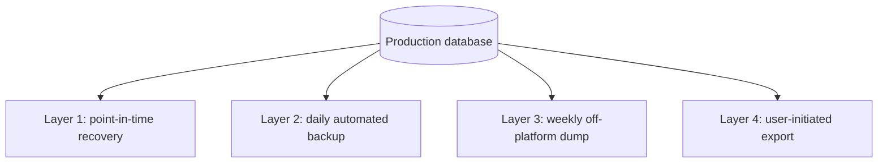

# 37 - Backup and Disaster Recovery

| Field        | Value      |
| ------------ | ---------- |
| Document ID  | DF-DOC-037 |
| Version      | 0.2.0      |
| Status       | Draft      |
| Owner        | Founder    |
| Last updated | 2026-08-04 |

---

## 1. Purpose

How DayFlow AI protects against losing user data, and how it recovers when something goes
wrong. This is the last document in the suite and arguably the most important, because
losing a user's history is the one failure the product cannot recover from
reputationally - and preventing it was the reason for ADR-001 in the first place.

## 2. What is being protected

A user's Moment history is irreplaceable. A deleted account can be recreated; a lost
password can be reset; two years of recorded time cannot be reconstructed by anyone.

This asymmetry sets the recovery objectives:

| Objective                      | Target                                         |
| ------------------------------ | ---------------------------------------------- |
| Recovery Point Objective (RPO) | Under 5 minutes of data loss in the worst case |
| Recovery Time Objective (RTO)  | Under 4 hours to restore service               |
| Maximum tolerable data loss    | Effectively zero for Moments                   |

## 3. Backup layers

Four independent layers, because any single mechanism will eventually fail at the moment it
is needed.



### Layer 1 - Point-in-time recovery

Supabase's write-ahead log, retaining 7 days on paid plans. Restores to any second within
that window, which is the layer that actually handles the realistic disaster: a bad
migration or an accidental bulk delete discovered an hour later.

Not available on the free tier. **Enabling it is the first thing to pay for**, ahead of any
other upgrade, because it is the only layer that can undo a mistake made minutes ago.

### Layer 2 - Daily automated backup

A full snapshot taken by Supabase daily, retained 7 days. Worst case loses up to 24 hours.

Also a paid feature. On the free tier neither layer 1 nor layer 2 exists, which means the
weekly dump below is not a supplementary precaution - it is the whole of the recovery
capability, and the RPO of five minutes stated in section 2 is unmet by roughly a week.
Treat that figure as the objective a paid plan buys, not as a description of the current
deployment. See section 2 of [GO-LIVE.md](../../GO-LIVE.md).

### Layer 3 - Weekly off-platform dump

A `pg_dump` taken weekly and stored somewhere outside Supabase entirely - encrypted object
storage or a local encrypted disk.

This layer exists for one specific scenario: Supabase itself becomes unavailable, whether
through an outage, an account suspension, or a billing problem. Layers 1 and 2 both live
inside the platform and are worthless if the platform is what has failed.

```bash
supabase db dump --linked -f "dayflow-$(date +%Y-%m-%d).sql"
```

### Layer 4 - User-initiated export

Any user can export everything at any time. It is not operationally a backup, but it is the
ultimate guarantee: a user who exports monthly can never lose more than a month regardless of
what happens to the infrastructure.

| ID         | Requirement                                                                             |
| ---------- | --------------------------------------------------------------------------------------- |
| DF-BAK-001 | Point-in-time recovery MUST be enabled before the product has users beyond the founder. |
| DF-BAK-002 | An off-platform dump MUST be taken at least weekly.                                     |
| DF-BAK-003 | Off-platform dumps MUST be encrypted at rest.                                           |
| DF-BAK-004 | A restore MUST be tested at least quarterly.                                            |
| DF-BAK-005 | Users SHOULD be prompted periodically to take their own export.                         |

DF-BAK-004 is the requirement most often skipped and most often regretted. An untested
backup is a hypothesis, not a backup, and the moment of discovery is always the worst
possible one.

## 4. Restore procedures

### 4.1 Accidental deletion by a single user

Fastest and most common.

1. Determine when the deletion occurred.
2. Restore to a staging project at a timestamp just before it.
3. Extract only that user's rows.
4. Re-insert into production.
5. Verify with the user.

Production is never restored wholesale for one user's mistake - that would discard everyone
else's writes since the timestamp.

### 4.2 Bad migration

1. Stop further deployments.
2. Assess: is the data corrupted, or only the schema?
3. Schema only - fix with a new forward migration.
4. Data corrupted - restore to just before the migration ran.
5. Reapply any legitimate writes made afterwards, if feasible.
6. Record as SEV1.

### 4.3 Total platform loss

The scenario Layer 3 exists for.

1. Create a new Supabase project, in a different region if the cause was regional.
2. Apply all migrations from the repository: `supabase db push`.
3. Restore data from the most recent off-platform dump.
4. Update `NEXT_PUBLIC_SUPABASE_URL` and both keys in Vercel.
5. Redeploy.
6. Re-register `pg_cron` jobs and restore `CRON_SECRET` to Vault.
7. Verify per the checklist in
   [33 - CI/CD and Deployment Runbook](../05-engineering/33-cicd-and-deployment-runbook.md).
8. Inform users what was lost, precisely and without minimising it.

Because the schema lives entirely in version-controlled migrations, rebuilding the structure
is a single command. Only the data needs restoring, which is what makes this recoverable at
all.

### 4.4 Ransomware or malicious deletion

Rotate every credential first, before restoring - restoring into a compromised environment
simply repeats the loss. Then restore to before the compromise, audit what was accessed, and
notify users per
[35 - Privacy and Data Protection](35-privacy-and-data-protection.md) section 11.

## 5. Quarterly restore drill

1. Create a scratch Supabase project.
2. Restore the most recent off-platform dump into it.
3. Point a local application build at it.
4. Sign in and confirm Moments, categories, settings and goals are all intact and correct.
5. Record how long the whole exercise took.
6. Destroy the scratch project.

Step 5 is the point of the drill. If the recovery time objective is four hours and the drill
takes six, then the objective is fiction and either the process or the target has to change.

## 6. Data integrity safeguards

Prevention is cheaper than recovery, and most data loss in a small product is
self-inflicted:

| Safeguard                                      | Prevents                                  |
| ---------------------------------------------- | ----------------------------------------- |
| Forward-only migrations                        | Accidental destructive reversal           |
| Destructive statements require a stated reason | Careless drops                            |
| `on delete restrict` on categories             | History destroyed by tidying a taxonomy   |
| Undo window on deletion                        | Mis-taps                                  |
| Typed confirmation for account deletion        | Catastrophic mis-clicks                   |
| CI rejecting edits to applied migrations       | Environment divergence                    |
| Generated `duration_minutes`                   | Derived values drifting from their source |

## 7. What is not backed up

| Not backed up      | Why                                             |
| ------------------ | ----------------------------------------------- |
| Server logs        | Transient, 30-day retention, no user value      |
| Client caches      | Rebuilt from the database                       |
| AI reports         | Regenerable from the facts, which are backed up |
| Push subscriptions | Devices re-subscribe automatically              |

AI reports are backed up in practice, since they live in the database, but their loss would
not be an incident - they can be regenerated.

## 8. Cost

| Layer                     | Cost                                       |
| ------------------------- | ------------------------------------------ |
| Point-in-time recovery    | Included from the Supabase Pro tier        |
| Daily backups             | Included                                   |
| Off-platform weekly dumps | Negligible; well under $1/month of storage |
| Quarterly drills          | About two hours of time                    |

Total additional cost is roughly $25/month at the point PITR becomes necessary. Set against
the irreplaceability of the data, this is the least contentious spending decision the
project will make.

---

## Change History

| Version | Date       | Author  | Change                                                                                              |
| ------- | ---------- | ------- | --------------------------------------------------------------------------------------------------- |
| 0.1.0   | 2026-08-04 | Founder | Initial draft.                                                                                      |
| 0.2.0   | 2026-08-04 | Founder | Recorded that backup layers 1 and 2 are paid features, so the stated RPO is unmet on the free plan. |
